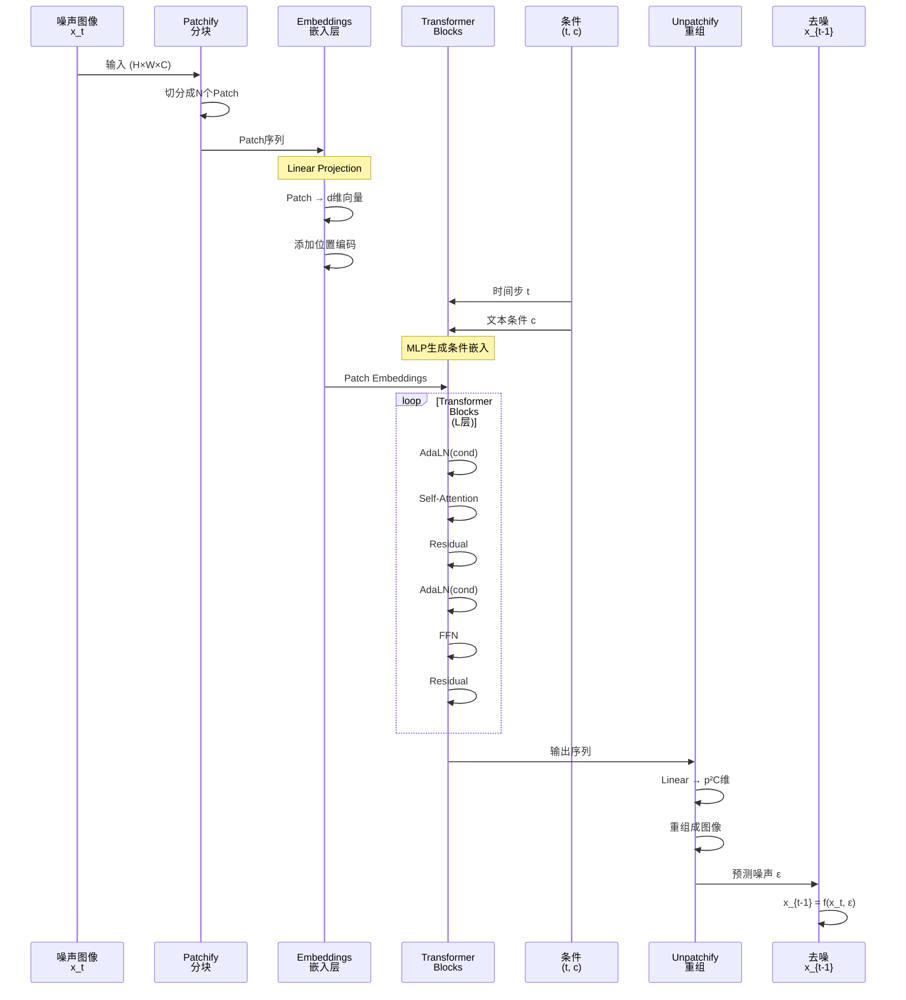

  **传统 Diffusion（DDPM、Stable Diffusion）：**
  ```
  噪声图像
    ↓
  U-Net（卷积神经网络）
    - 擅长：局部特征（边缘、纹理）
    - 短板：全局理解（整体布局、远距离关系）
    ↓
  去噪后的图像
  ```

  **DiT（Diffusion Transformer）：**
  ```
  噪声图像
    ↓
  Transformer（自注意力机制）
    - 擅长：全局理解（整张图的布局）
    - 擅长：长距离依赖（视频的时间连贯性）
    - 擅长：扩展性（参数越大效果越好）
    ↓
  去噪后的图像/视频
  ```

  ---

  **核心创新（以 Sora 为例）：**

  **1. Patch化（分块处理）**
  ```
  视频（1920×1080×120帧）
    ↓
  切成小块（Patch）：
    - 每个Patch：16×16像素×2帧
    - 总共：120×67.5×60 = 486,000个Patch
    ↓
  每个Patch变成一个Token（像文本的"词"）
    ↓
  Transformer处理Token序列
  ```

  **2. Spacetime Patch（时空块）**
  ```
  传统：空间Patch（只看一帧的16×16区域）
  DiT：时空Patch（看2帧的16×16区域）

  好处：
  - 同时理解空间+时间信息
  - 视频更连贯（不会闪烁）
  ```

  **3. Transformer的优势**
  ```
  Self-Attention（自注意力）：
  - 每个Patch都能"看到"其他所有Patch
  - 理解全局布局（例如：天空在上，草地在下）
  - 理解时间连贯（例如：猫从左跑到右）

  U-Net的局限：
  - 卷积只看局部（3×3窗口）
  - 需要堆叠很多层才能看到全局
  - 难以处理长视频
  ```

  ---

  **DiT 架构详解：**

  ```
  输入：噪声视频Patch + 时间步t + 文本条件c
    ↓
  步骤1：Patch Embedding
    每个Patch → 嵌入向量（768维）
    添加位置编码（告诉模型这是第几个Patch）
    ↓
  步骤2：Transformer Blocks（重复N次）
    ┌─────────────────────┐
    │ Layer Norm          │
    │ Self-Attention      │ ← 全局理解
    │ Layer Norm          │
    │ Cross-Attention     │ ← 融合文本条件
    │ Layer Norm          │
    │ Feed-Forward Network│
    └─────────────────────┘
    ↓
  步骤3：输出层
    预测每个Patch的噪声
    ↓
  步骤4：重组
    Patch → 视频帧
    ↓
  去噪后的视频
  ```

  ---

  **DiT vs U-Net 对比：**

  | 特性 | U-Net | DiT（Transformer） |
  |------|-------|-------------------|
  | **架构** | 卷积+下采样/上采样 | Transformer Blocks |
  | **感受野** | 局部（需堆叠） | 全局（一步到位） |
  | **长距离依赖** | 弱 | 强 |
  | **视频处理** | 需3D卷积 | 原生支持（Spacetime Patch） |
  | **扩展性** | 差（参数↑效果不明显） | 好（参数↑效果↑） |
  | **计算复杂度** | O(HWC) | O((HW/P²)²)（Patch数的平方） |
  | **代表模型** | DDPM、Stable Diffusion | Sora、DiT |

  ---

  **为什么 Sora 用 DiT？**

  **1. 视频长度可变**
  ```
  U-Net：固定输入尺寸（512×512）
  DiT：任意长度（Patch数量可变）

  → Sora可以生成5秒到60秒的视频
  ```

  **2. 分辨率可变**
  ```
  U-Net：需要为每个分辨率训练
  DiT：同一个模型支持多分辨率

  → Sora可以生成1080p、4K视频
  ```

  **3. 时间连贯性**
  ```
  U-Net：逐帧处理，容易闪烁
  DiT：Spacetime Patch，时间平滑

  → Sora生成的视频更流畅
  ```

  **4. 扩展性（Scaling Law）**
  ```
  U-Net：参数从100M → 1B，效果提升有限
  DiT：参数从1B → 10B → 100B，效果持续提升

  → Sora可以用更大模型获得更好效果
  ```

  ---

  **DiT 的计算挑战：**

  **问题：Transformer的复杂度是O(N²)**

  ```
  视频：1920×1080×120帧
  Patch大小：16×16×2帧
  Patch数量：N = 486,000

  Self-Attention计算：
  N² = 486,000² = 236,196,000,000（2360亿次）

  → 太慢了！
  ```

  **优化方案：**

  **1. Flash Attention**
  - 减少显存访问
  - 速度提升2-4倍

  **2. 分块Attention（Windowed Attention）**
  ```
  不是每个Patch看所有Patch
  而是每个Patch只看附近的M个Patch

  复杂度：O(N²) → O(N·M)
  ```

  **3. 混合精度训练**
  - FP16/BF16计算
  - 显存省一半

  **4. 模型并行**
  - 跨多张GPU分布计算
  - Sora可能用了数千张GPU

  ---

  **实际应用：**

  **1. Sora（OpenAI）**
  - 文生视频，最长60秒
  - 多分辨率（1080p、4K）
  - DiT架构 + Spacetime Patch

  **2. Imagen Video（Google）**
  - 文生视频
  - 级联Diffusion + Transformer

  **3. Make-A-Video（Meta）**
  - 文生视频
  - 3D U-Net + Transformer

  ---

  **训练 DiT 的技巧：**

  **1. AdaLN（Adaptive Layer Normalization）**
  ```
  普通Layer Norm：
    输出 = (x - mean) / std

  AdaLN：
    输出 = γ(t,c) * (x - mean) / std + β(t,c)

    其中：
    - γ, β 由时间步t和条件c生成
    - 让模型知道"现在是第几步去噪"
  ```

  **2. 位置编码（Positional Encoding）**
  ```
  2D位置编码（图像）：
    pos = [x坐标编码, y坐标编码]

  3D位置编码（视频）：
    pos = [x坐标编码, y坐标编码, t时间编码]
  ```

  **3. 预训练策略**
  ```
  阶段1：图像预训练（便宜）
    - 学习空间特征
    - 学习去噪能力

  阶段2：视频微调（贵）
    - 学习时间特征
    - 学习运动连贯性
  ```

  ---

  **常见误区：**

  **误区1："DiT就是把U-Net换成Transformer"**
  - 不只是替换！还有很多配套改进：
    - Patch化输入
    - AdaLN条件注入
    - 新的位置编码

  **误区2："DiT一定比U-Net好"**
  - 不一定！
    - 小数据集：U-Net更好（归纳偏置）
    - 大数据集：DiT更好（扩展性）
    - 实时应用：U-Net更快

  **误区3："Sora只用了DiT"**
  - 不对！Sora还用了：
    - VAE（压缩到潜在空间）
    - CLIP（文本编码）
    - Classifier-Free Guidance（条件控制）

  说白了，DiT就是"Diffusion模型的Transformer化"——用Transformer的全局理解能力和扩展性，解决U-Net在视频生成、大模型训练上的短板，是Sora等前沿视频生成模型的核心技术。
---


<!-- TODO: 添加DiT架构对比图，展示U-Net vs Transformer的区别 -->


DiT：让 Transformer 来去噪，空间与时间一起推理，全局视野拉满。

## 为什么它重要（≤5min）
- 全局理解更强：长距离关系与时序更自然。
- 扩展性更好：参数↑效果↑，适合大模型与视频。

## 怎么做（三件套）
- Patch化：把图像/视频切块成“词”。
- Self-Attention：块与块全局对话。
- 条件注入：AdaLN把文本/时间融进去。


## 优缺点（一句到位）
- 优点：全局视野、可扩展性强、视频友好。
- 缺点：注意力复杂度高，算力要跟上。

## 易错点（别踩坑）
- 只是换骨干：Patch/AdaLN/位置编码同样关键。
- 一定更好？小数据或实时任务U-Net常更稳更快。

## 适用场景（马上用得上）
- 文生视频：Sora 类架构
- 高分辨率图像生成：DiT 家族

## 参考图源（供重绘或嵌入）
- DiT论文架构图（建议抽象重绘为模块化SVG）

## 一页总结
- 选择权在算力：算力到位，DiT到位。

## 核心概念

### DiT的设计思想

**问题：** U-Net在Diffusion模型中的局限性

**U-Net的问题：**
```
1. 归纳偏置强（Inductive Bias）：
   - 卷积的局部性假设
   - 难以捕捉长距离依赖

2. 扩展性差（Scalability）：
   - 参数增加，效果提升有限
   - 不遵循Scaling Law

3. 架构复杂：
   - 下采样-上采样结构
   - Skip connection
   - 难以适配可变输入
```

**DiT的解决方案：**
```
用Transformer替代U-Net：
1. 全局感受野（Self-Attention）
2. 优秀的扩展性（参数↑→效果↑）
3. 架构简洁（堆叠Transformer Blocks）
4. 灵活性高（支持可变长度/分辨率）
```

### 核心组件

**Patchify（图像分块）：**
- 功能：将图像切分成Patch序列
- 类似：ViT的做法
- 输出：Patch embeddings

**Transformer Blocks：**
- 功能：处理Patch序列
- 组件：Self-Attention + FFN
- 条件注入：通过AdaLN

**Unpatchify（重组）：**
- 功能：Patch序列 → 图像
- 输出：预测的噪声或去噪后的图像

## 工作流程

### DiT架构详解

**完整流程：**

```
步骤1：输入处理

噪声图像 x_t（H×W×C）
  ↓
Patchify（分块）：
  Patch大小：p×p
  Patch数量：N = (H/p) × (W/p)
  ↓
Patch序列：[x₁, x₂, ..., x_N]（每个Patch是p²C维）
  ↓
Linear Projection：
  每个Patch → d维向量
  ↓
添加位置编码：
  patch_emb + pos_emb
  ↓
Patch Embeddings：[e₁, e₂, ..., e_N]（每个是d维）

---

步骤2：条件嵌入

时间步 t：
  t → MLP → t_emb（d维）

文本条件 c：
  c → Text Encoder → c_emb（d维）

组合条件：
  cond = t_emb + c_emb

---

步骤3：Transformer Blocks（重复L次）

for l = 1 to L:
  ┌─────────────────────────────┐
  │ Adaptive Layer Norm (AdaLN) │ ← 注入条件cond
  │   ↓                         │
  │ Multi-Head Self-Attention   │ ← 全局理解
  │   ↓                         │
  │ Residual Connection         │
  │   ↓                         │
  │ Adaptive Layer Norm (AdaLN) │
  │   ↓                         │
  │ Feed-Forward Network        │
  │   ↓                         │
  │ Residual Connection         │
  └─────────────────────────────┘

---

步骤4：输出处理

Transformer输出：[h₁, h₂, ..., h_N]（每个是d维）
  ↓
Linear Layer：
  每个h_i → p²C维
  ↓
Unpatchify（重组）：
  [h₁, h₂, ..., h_N] → 噪声预测 ε（H×W×C）
  ↓
去噪：
  x_{t-1} = (x_t - β_t·ε) / √(1-β_t)
```

### DiT时序图



### Adaptive Layer Normalization (AdaLN)

**核心创新：** 通过条件调制归一化参数

**传统Layer Norm：**

```math
\text{output} = \frac{x - \text{mean}}{\text{std}}
```

**AdaLN：**

```math
\text{output} = \gamma(\text{cond}) \cdot \frac{x - \text{mean}}{\text{std}} + \beta(\text{cond})
```

其中：
- $\gamma, \beta$ 由条件 $\text{cond}$（时间步+文本）通过MLP生成
- 每层的 $\gamma, \beta$ 都不同

**实现：**
```python
# 伪代码
class AdaLN(nn.Module):
    def __init__(self, dim):
        self.mlp = MLP(dim, dim*2)  # 输出γ和β

    def forward(self, x, cond):
        # x: (batch, seq_len, dim)
        # cond: (batch, dim)

        # 生成γ和β
        scale_shift = self.mlp(cond)  # (batch, dim*2)
        gamma, beta = scale_shift.chunk(2, dim=-1)

        # Layer Norm
        x_norm = (x - x.mean(dim=-1, keepdim=True)) / x.std(dim=-1, keepdim=True)

        # 调制
        output = gamma.unsqueeze(1) * x_norm + beta.unsqueeze(1)
        return output
```

**优势：**
- 条件信息深度注入每一层
- 比简单的条件拼接更有效
- 参数高效

## Spacetime DiT（视频扩展）

### 从图像到视频

**图像DiT：**
```
输入：单帧图像（H×W×C）
Patch：2D Patch（p×p）
```

**视频DiT（Spacetime Patch）：**
```
输入：视频（T×H×W×C）
Patch：3D Patch（p_t×p_h×p_w）

示例：
- 时间维度：p_t = 2帧
- 空间维度：p_h = p_w = 16像素
- 每个Patch：2×16×16×3 = 1536个值
```

**Spacetime Attention：**
```
每个Patch的Token包含：
- 空间信息（16×16像素）
- 时间信息（2帧）

Self-Attention同时建模：
- 空间关系（同一帧的不同位置）
- 时间关系（不同帧的同一位置）
```

### Sora的DiT架构（推测）

```
输入：视频（可变长度/分辨率）
  ↓
VAE Encoder：
  视频 → 潜在表示（缩小8倍）
  ↓
Spacetime Patchify：
  潜在表示 → 3D Patch序列
  ↓
Transformer（DiT）：
  - 参数量：估计10B+
  - 层数：估计48+层
  - 注意力：Spacetime Self-Attention
  - 条件：T5文本嵌入（通过AdaLN注入）
  ↓
Unpatchify：
  Patch序列 → 潜在表示
  ↓
VAE Decoder：
  潜在表示 → 视频
```

## DiT vs U-Net对比

### 架构对比

| 维度 | U-Net | DiT |
|------|-------|-----|
| **骨干网络** | 卷积层 | Transformer Blocks |
| **下采样/上采样** | 需要 | 不需要 |
| **Skip Connection** | 需要 | 不需要 |
| **感受野** | 局部（卷积核大小） | 全局（Self-Attention） |
| **位置信息** | 隐式（卷积位置不变性） | 显式（位置编码） |
| **条件注入** | 多种方式（拼接、调制等） | AdaLN |
| **架构复杂度** | 高 | 低（堆叠blocks） |

### 性能对比

**DiT的优势：**

1. **扩展性（Scaling）：**
```
DiT：
  - 100M参数：FID=50
  - 1B参数：FID=20
  - 10B参数：FID=5
  （参数↑→效果↑，遵循Scaling Law）

U-Net：
  - 100M参数：FID=50
  - 1B参数：FID=45
  （参数↑→效果提升有限）
```

2. **全局理解：**
```
U-Net：
  - 需要堆叠多层才能看到全局
  - 层数有限（显存限制）

DiT：
  - 一步Self-Attention看到全局
  - 更好的布局一致性
```

3. **灵活性：**
```
U-Net：
  - 固定输入尺寸
  - 不同分辨率需重新训练

DiT：
  - 可变Patch数量
  - 同一模型支持多分辨率/长度
```

**U-Net的优势：**

1. **归纳偏置：**
```
数据少时：
  - U-Net的局部性假设有帮助
  - 收敛更快

DiT：
  - 需要大量数据学习局部性
```

2. **计算效率：**
```
U-Net复杂度：O(HWC)
DiT复杂度：O((HW/p²)²)

小图像时U-Net更快
```

## 实际应用

### 1. Sora（OpenAI）

**架构：**
- Spacetime DiT
- VAE压缩
- T5文本编码
- Classifier-Free Guidance

**能力：**
- 文生视频（最长60秒）
- 多分辨率（1080p、4K）
- 可变宽高比

### 2. Imagen Video（Google）

**架构：**
- 级联Diffusion（7个模型）
- 基础模型：Transformer-based
- 超分模型：U-Net-based

### 3. 学术研究

**DiT论文（ICCV 2023）：**
```
模型规模：
- DiT-S（Small）：33M参数
- DiT-B（Base）：130M参数
- DiT-L（Large）：458M参数
- DiT-XL（XLarge）：675M参数

结果：
- DiT-XL在ImageNet 256×256上FID=2.27
- 超越之前所有Diffusion模型
```

## 优化技巧

### 1. Flash Attention

**问题：** Self-Attention的IO瓶颈

**解决方案：**
```
传统Attention：
  - 多次读写HBM（高带宽内存）
  - 速度慢

Flash Attention：
  - 分块计算
  - 减少HBM访问
  - 速度提升2-4倍
```

### 2. Gradient Checkpointing

**问题：** Transformer显存占用大

**解决方案：**
```
不存储所有中间激活
只存储部分，需要时重新计算

代价：计算时间+30%
好处：显存-50%
```

### 3. 混合精度训练

```
计算：BF16（更快）
梯度累积：FP32（更稳定）

显存省一半，速度提升2倍
```

## 常见问题

**Q: DiT适合所有Diffusion任务吗？**

A:
- **适合**：大规模、高分辨率、视频生成
- **不适合**：小数据集、实时应用

**Q: DiT的计算成本？**

A:
```
DiT-XL（675M参数）：
- 训练：256×A100 GPU × 数周
- 推理：1×A100 GPU，50步DDIM，约5秒/张（256×256）

Sora（估计10B+参数）：
- 训练：数千GPU × 数月
- 推理：多张GPU，50步，约1-2分钟/视频
```

**Q: 如何选择Patch大小？**

A:
- **图像**：p=16（标准）、p=8（高细节）、p=32（快速）
- **视频**：空间p=16，时间p_t=2-4帧

**Q: DiT能用于图像编辑吗？**

A: 可以，通过：
- Inpainting（图像修复）
- Image-to-Image（图像转换）
- ControlNet适配

## 参考资料

- [Scalable Diffusion Models with Transformers](https://arxiv.org/abs/2212.09748) - DiT原论文
- [Video generation models as world simulators](https://openai.com/research/video-generation-models-as-world-simulators) - Sora技术报告
- [Attention Is All You Need](https://arxiv.org/abs/1706.03762) - Transformer原论文
- [什么是Diffusion Model](/guide/video/generation/what-is-diffusion-model) - 本站相关文章
- [什么是ViT](/guide/video/understanding/what-is-ViT) - 本站相关文章
