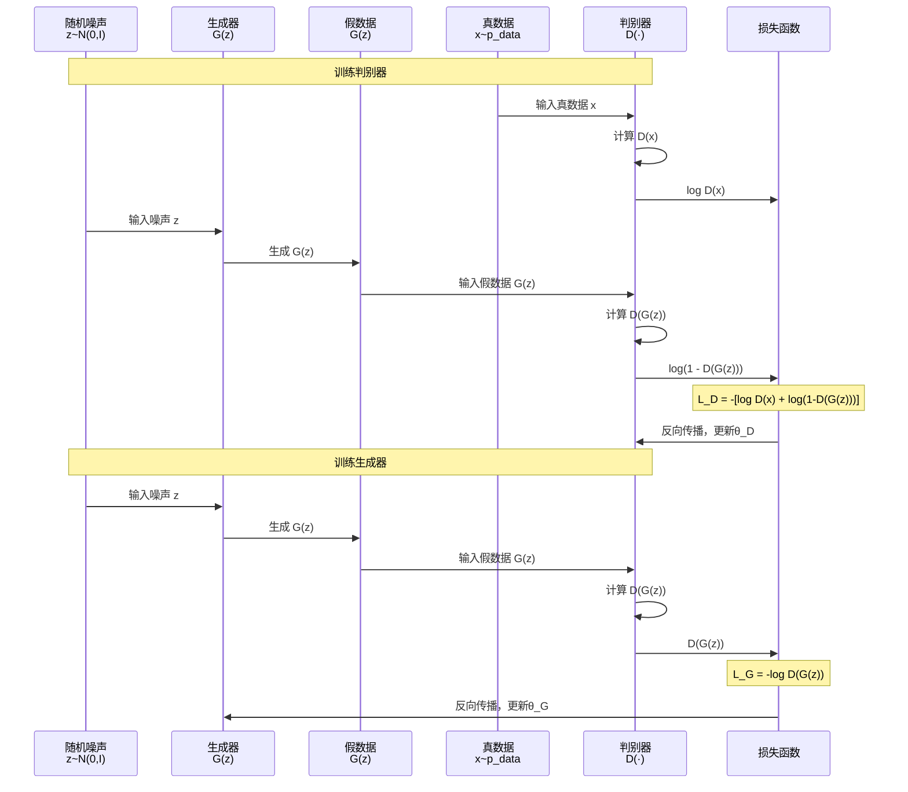

  **游戏规则：**
  ```
  生成器（Generator）："我是造假者，我要画假猫骗过鉴定师"
  判别器（Discriminator）："我是鉴定师，我要分辨真猫和假猫"

  第1回合：
  生成器：画了一只很丑的假猫（随机噪声）
  判别器："这是假的！（100%确定）"
  生成器：（学习）下次画得更像一点

  第10回合：
  生成器：画了一只有点像的猫
  判别器："这还是假的！（80%确定）"
  生成器：（学习）继续改进

  第1000回合：
  生成器：画了一只超逼真的猫
  判别器："我...我也不确定了...可能50%是真的？"
  生成器：（成功！）骗过鉴定师了
  ```

  ---

  **核心流程：**

  ```
  训练循环：

  步骤1：训练判别器（Discriminator）
    拿真猫照片：
      → 判别器判断："真的"（输出1）
      → 如果判断错，惩罚判别器

    拿生成器造的假猫：
      → 判别器判断："假的"（输出0）
      → 如果判断错，惩罚判别器

    目标：判别器学会分辨真假

  ---

  步骤2：训练生成器（Generator）
    生成器造假猫：
      随机噪声 → 生成器 → 假猫照片

    判别器判断假猫：
      → 输出："这是假的（0.1）"

    生成器的目标：让判别器输出"这是真的（1.0）"
      → 如果判别器没被骗到，惩罚生成器
      → 生成器调整参数，下次画得更像

  ---

  重复步骤1和2，直到：
    - 生成器：能造出以假乱真的猫
    - 判别器：再也分不出真假（输出0.5，纯猜测）
  ```

  ---

  **数学本质（简化版）：**

  **生成器的目标：**
  ```
  max log(D(G(z)))

  意思：
  - z：随机噪声
  - G(z)：生成器造的假图
  - D(G(z))：判别器认为假图是真的概率
  - 生成器要最大化这个概率（骗过判别器）
  ```

  **判别器的目标：**
  ```
  max log(D(x)) + log(1 - D(G(z)))

  意思：
  - x：真图
  - D(x)：判别器认为真图是真的概率（要接近1）
  - D(G(z))：判别器认为假图是真的概率（要接近0）
  - 判别器要最大化分辨能力
  ```

  **对抗过程：**
  ```
  min_G max_D V(D, G) = E[log D(x)] + E[log(1 - D(G(z)))]

  意思：
  - 判别器要max（最大化分辨能力）
  - 生成器要min（最小化被识破的概率）
  - 这是一个零和博弈（minimax game）
  ```

  ---

  **GAN的优势：**

  **1. 生成质量高**
  ```
  VAE生成的图：模糊
  GAN生成的图：清晰、逼真

  原因：
  - VAE用L2损失 → 倾向生成"平均"图像
  - GAN用对抗损失 → 必须骗过判别器，细节更真实
  ```

  **2. 生成速度快**
  ```
  Diffusion：需要1000步去噪
  GAN：一步生成（随机噪声 → 图像）

  实时应用优选GAN
  ```

  **3. 无需显式建模数据分布**
  ```
  VAE：需要假设数据分布（高斯分布）
  GAN：隐式学习分布（通过对抗）

  更灵活
  ```

  ---

  **GAN的挑战：**

  **1. 训练不稳定（Training Instability）**
  ```
  问题：生成器和判别器不平衡

  情况1：判别器太强
    - 判别器：100%识别假图
    - 生成器：得不到有用梯度，无法改进
    - 结果：生成器训练停滞

  情况2：生成器太强
    - 生成器：完全骗过判别器
    - 判别器：随机猜测
    - 结果：判别器失效，生成器失去指导

  → 需要精心平衡两者训练
  ```

  **2. 模式崩塌（Mode Collapse）**
  ```
  问题：生成器只生成少数几种图像

  例如：
  训练目标：生成各种猫（橘猫、黑猫、白猫...）
  结果：生成器发现"橘猫最容易骗过判别器"
  → 只生成橘猫
  → 多样性丧失

  原因：
  生成器找到"捷径"（局部最优）
  ```

  **3. 梯度消失（Vanishing Gradients）**
  ```
  问题：判别器太强，梯度消失

  数学原因：
  判别器输出 D(G(z)) ≈ 0（完全识破）
  → log(D(G(z))) → -∞
  → 梯度接近0
  → 生成器无法更新

  解决方案：
  - 改损失函数（Wasserstein GAN）
  - 限制判别器能力
  ```

  ---

  **GAN的演进：**

  **1. DCGAN（Deep Convolutional GAN）**
  ```
  创新：用卷积网络替代全连接层

  架构：
  生成器：
    噪声(100维) → FC → 反卷积×5 → 图像(64×64)

  判别器：
    图像(64×64) → 卷积×5 → FC → 真/假

  技巧：
    - 用BatchNorm稳定训练
    - 生成器用ReLU，判别器用LeakyReLU
    - 去掉全连接层（除了首尾）
  ```

  **2. Conditional GAN（CGAN）**
  ```
  创新：条件生成（指定类别）

  生成器：
    输入：噪声z + 类别c
    输出：类别c的图像

  判别器：
    输入：图像x + 类别c
    输出：x是类别c的真图概率

  应用：
    - 指定生成"猫"或"狗"
    - 文生图（文本作为条件）
  ```

  **3. StyleGAN（Style-based GAN）**
  ```
  创新：渐进式生成 + 风格控制

  架构：
    噪声z → Mapping Network → w（风格向量）
    w → 多层AdaIN（自适应归一化）
      - 层1：控制粗糙特征（布局、姿势）
      - 层5：控制中等特征（发型、五官）
      - 层10：控制精细特征（肤色、纹理）

  优势：
    - 生成质量极高（FID=2.84，FFHQ数据集）
    - 可控编辑（改变发型、年龄、表情）
  ```

  **4. Pix2Pix（图像到图像翻译）**
  ```
  创新：成对图像翻译

  任务：
    - 草图 → 照片
    - 黑白图 → 彩色图
    - 白天图 → 夜晚图

  架构：
    生成器：U-Net
    判别器：PatchGAN（判断每个Patch真假）

  损失：
    L = L_GAN + λ L_L1
    （对抗损失 + 像素级L1损失）
  ```

  **5. CycleGAN（无配对翻译）**
  ```
  创新：无需成对数据

  任务：
    - 马 ↔ 斑马
    - 照片 ↔ 莫奈画作

  架构：
    两个生成器：G(A→B), F(B→A)
    两个判别器：D_A, D_B

  循环一致性：
    x → G(x) → F(G(x)) ≈ x
    （A→B→A，要能还原）

  损失：
    L = L_GAN + λ L_cycle
  ```

  **6. BigGAN**
  ```
  创新：大规模训练（ImageNet，1000类）

  技巧：
    - 大Batch Size（2048）
    - 正交正则化（Orthogonal Regularization）
    - 截断技巧（Truncation Trick）

  结果：
    - ImageNet 512×512，FID=6.95
    - 多样性和质量都高
  ```

  ---

  **GAN vs Diffusion：**

  | 特性 | GAN | Diffusion |
  |------|-----|-----------|
  | **生成速度** | 快（1步） | 慢（50-1000步） |
  | **生成质量** | 高 | 更高 |
  | **训练稳定性** | 差（对抗训练） | 好（固定去噪目标） |
  | **模式崩塌** | 常见 | 罕见 |
  | **多样性** | 中 | 高 |
  | **可控性** | 中（需设计） | 高（天然支持条件） |
  | **适用场景** | 实时生成、图像翻译 | 高质量生成、文生图 |

  ---

  **实际应用：**

  **1. 人脸生成**
  ```
  StyleGAN2：
    - This Person Does Not Exist
    - 生成不存在的人脸
    - 质量接近真实照片
  ```

  **2. 图像超分辨率**
  ```
  ESRGAN：
    - 低分辨率 → 高分辨率
    - 用GAN恢复真实纹理
    - 优于传统插值方法
  ```

  **3. 图像修复**
  ```
  DeepFillv2：
    - 去除图像中的物体
    - GAN填充缺失区域
    - 结果自然、逼真
  ```

  **4. 视频生成**
  ```
  TGAN、MoCoGAN：
    - 生成短视频片段
    - 时间连贯性通过3D卷积
    - 应用：动作生成、视频插帧
  ```

  **5. 数据增强**
  ```
  训练数据不足时：
    - 用GAN生成合成数据
    - 扩充训练集
    - 提升模型泛化能力
  ```

  ---

  **常见误区：**

  **误区1："GAN已经过时了，Diffusion更好"**
  - 不对！看场景：
    - 实时应用：GAN更合适（快）
    - 高质量离线生成：Diffusion更好
    - 图像翻译：GAN仍是主流（Pix2Pix, CycleGAN）

  **误区2："GAN训练一定不稳定"**
  - 早期确实如此
  - 现代GAN（StyleGAN, BigGAN）已经很稳定
  - 关键：架构设计 + 训练技巧

  **误区3："模式崩塌无解"**
  - 有解决方案：
    - Unrolled GAN（展开优化）
    - Minibatch Discrimination（批次判别）
    - Spectral Normalization（谱归一化）

  说白了，GAN就是"真假对抗游戏"——通过让生成器和判别器互相对抗，最终生成器能造出以假乱真的内容。虽然训练不稳定、容易模式崩塌，但生成速度快、质量高，在实时应用和图像翻译领域仍是主流选择。
---


<!-- TODO: 添加GAN对抗训练示意图，展示Generator vs Discriminator -->


GAN：造假与识假的一场对抗，越斗越真，速度飞快但脾气不小。

## 为什么它重要（≤5min）
- 追求“快又真”的生成，尤其适合实时或低延迟场景。

## 怎么做（对抗循环）
- 生成器：把噪声变图，力图“骗过”判别器。
- 判别器：分辨真伪，逼迫生成器变强。
- 交替训练，直至“分不清”为止。


## 优缺点（一句到位）
- 优点：质量真、速度快。
- 缺点：训练不稳、模式崩塌风险。

## 易错点（别踩坑）
- 以为GAN过时：实时场景它仍能打。
- 忽视稳定技巧：WGAN/谱归一化/小心判别器强度。

## 适用场景（马上用得上）
- 人脸生成、图像翻译、超分辨率、修复等。

## 参考图源（供重绘或嵌入）
- DCGAN/StyleGAN 对抗框图（可抽取关键模块进行SVG重绘）

## 一页总结
- 本质是博弈：你强我更强。
- 目标是均衡：稳定技巧一个不能少。

## 核心概念

### GAN的设计思想

**问题：** 如何生成逼真的数据？

**传统生成模型的问题：**
```
VAE：
  - 显式建模p(x)
  - 假设数据分布（高斯）
  - 生成图像模糊

自回归模型：
  - 像素逐个生成
  - 速度慢

GAN的创新：
  - 隐式学习数据分布
  - 通过对抗训练
  - 无需假设分布形式
```

**对抗训练：**
```
生成器（Generator）：
  - 目标：造假数据骗过判别器
  - 输入：随机噪声
  - 输出：假数据

判别器（Discriminator）：
  - 目标：分辨真假数据
  - 输入：真数据或假数据
  - 输出：真假概率

对抗：
  - 生成器越来越会造假
  - 判别器越来越会识别
  - 最终平衡：判别器无法分辨（50%概率）
```

### 核心组件

**生成器（Generator）：**
- 功能：从噪声生成数据
- 输入：潜在向量z ~ p(z)（通常高斯分布）
- 输出：生成数据G(z)
- 目标：max log D(G(z))

**判别器（Discriminator）：**
- 功能：判断数据真假
- 输入：真数据x或假数据G(z)
- 输出：真实概率D(x) ∈ [0,1]
- 目标：max log D(x) + log(1-D(G(z)))

## 工作流程

### 完整训练流程

```
初始化：
  随机初始化G和D的参数

训练循环（Epoch 1 to N）：

  for 每个mini-batch：

    # 步骤1：训练判别器（k次，通常k=1）
    for i in 1 to k:

      # 采样真数据
      {x₁, x₂, ..., x_m} ~ p_data(x)

      # 采样噪声，生成假数据
      {z₁, z₂, ..., z_m} ~ p_z(z)
      {G(z₁), G(z₂), ..., G(z_m)}

      # 计算判别器损失
      L_D = -[log D(x) + log(1 - D(G(z)))]

      # 更新判别器
      θ_D ← θ_D - α ∇L_D

    ---

    # 步骤2：训练生成器（1次）

      # 采样噪声
      {z₁, z₂, ..., z_m} ~ p_z(z)

      # 计算生成器损失
      L_G = -log D(G(z))

      # 更新生成器
      θ_G ← θ_G - α ∇L_G

---

训练结束条件：
  - 判别器输出接近0.5（无法分辨真假）
  - 生成质量满意（FID、IS等指标）
```

### GAN时序图



## 数学原理

### 目标函数

**Minimax博弈：**
```
min_G max_D V(D, G) = E_{x~p_data}[log D(x)] + E_{z~p_z}[log(1 - D(G(z)))]

解释：
- 判别器D要max：最大化分辨真假的能力
- 生成器G要min：最小化被识破的概率
```

**判别器的最优解：**
```
D*(x) = p_data(x) / (p_data(x) + p_g(x))

其中：
- p_data(x)：真实数据分布
- p_g(x)：生成数据分布

当p_g = p_data时：
  D*(x) = 1/2（无法分辨真假）
```

**全局最优：**
```
当 p_g = p_data 时，达到纳什均衡

此时：
  V(D*, G*) = -log 4
  D*(x) = 1/2
```

### 梯度分析

**生成器的梯度问题：**
```
原始损失：L_G = log(1 - D(G(z)))

问题：
  训练早期，D(G(z)) ≈ 0（判别器轻松识破）
  → log(1 - D(G(z))) ≈ 0
  → 梯度接近0
  → 生成器训练停滞

解决方案：
  改用：L_G = -log D(G(z))

  效果：
    - 训练早期，D(G(z)) ≈ 0
    - -log D(G(z)) ≈ +∞
    - 梯度很大，训练有动力
```

## GAN的挑战与解决方案

### 1. 训练不稳定

**问题表现：**
```
- 损失震荡
- 梯度爆炸/消失
- 难以收敛
```

**解决方案：**

**a) Wasserstein GAN (WGAN)**
```
改进：用Wasserstein距离替代JS散度

新目标函数：
  W(p_data, p_g) = inf_{γ~Π(p_data,p_g)} E_{(x,y)~γ}[||x-y||]

优势：
  - 损失有意义（越低越好）
  - 梯度更稳定
  - 支持更强的判别器

实现：
  - 去掉判别器最后的Sigmoid
  - 限制判别器Lipschitz连续（权重裁剪或梯度惩罚）
```

**b) Spectral Normalization**
```
思想：约束判别器的Lipschitz常数

方法：
  W_SN = W / σ(W)

  其中σ(W)是W的最大奇异值

效果：
  - 稳定训练
  - 无需调参
  - BigGAN、StyleGAN都用
```

### 2. 模式崩塌

**问题表现：**
```
生成器只生成少数几种样本
多样性丧失
```

**解决方案：**

**a) Minibatch Discrimination**
```
思想：让判别器看整个batch

方法：
  在判别器中添加层，计算样本间相似度
  → 如果batch内样本都很像（模式崩塌）
  → 判别器更容易识破

效果：
  鼓励生成器生成多样化样本
```

**b) Unrolled GAN**
```
思想：生成器优化时"预判"判别器的更新

方法：
  生成器优化时，先模拟判别器更新k步
  → 基于更新后的判别器计算梯度

效果：
  避免生成器陷入局部最优
```

### 3. 评估困难

**问题：** 损失函数不能反映生成质量

**解决方案：**

**a) Inception Score (IS)**

```math
\text{IS} = \exp(\mathbb{E}_x[\text{KL}(p(y|x) \| p(y))])
```

意思：
- $p(y|x)$：生成图像的预测类别分布（应该确定）
- $p(y)$：所有生成图像的类别分布（应该均匀）

高分意味着：
- 每张图类别明确（质量高）
- 所有图类别多样（多样性好）

**b) Fréchet Inception Distance (FID)**

```math
\text{FID} = \|\mu_{real} - \mu_{gen}\|^2 + \text{Tr}(\Sigma_{real} + \Sigma_{gen} - 2\sqrt{\Sigma_{real} \cdot \Sigma_{gen}})
```

意思：
- 提取真图和生成图的Inception特征
- 假设特征服从高斯分布
- 计算两个分布的距离

低分更好（生成分布接近真实分布）

## GAN变体

### DCGAN

**创新：** 卷积架构 + 训练技巧

**生成器架构：**
```
输入：z（100维噪声）
  ↓
全连接：100 → 4×4×1024
  ↓
Reshape：4×4×1024
  ↓
转置卷积：4×4×1024 → 8×8×512（stride=2）
BatchNorm + ReLU
  ↓
转置卷积：8×8×512 → 16×16×256
BatchNorm + ReLU
  ↓
转置卷积：16×16×256 → 32×32×128
BatchNorm + ReLU
  ↓
转置卷积：32×32×128 → 64×64×3
Tanh
  ↓
输出：64×64×3图像
```

**判别器架构：**
```
输入：64×64×3图像
  ↓
卷积：64×64×3 → 32×32×128（stride=2）
LeakyReLU
  ↓
卷积：32×32×128 → 16×16×256
BatchNorm + LeakyReLU
  ↓
卷积：16×16×256 → 8×8×512
BatchNorm + LeakyReLU
  ↓
卷积：8×8×512 → 4×4×1024
BatchNorm + LeakyReLU
  ↓
全连接：4×4×1024 → 1
Sigmoid
  ↓
输出：真假概率
```

**训练技巧：**
- 去掉全连接层（除了首尾）
- 用BatchNorm（除了生成器输出层和判别器输入层）
- 生成器用ReLU，判别器用LeakyReLU
- 用Adam优化器，lr=0.0002, β₁=0.5

### StyleGAN

**创新：** 风格控制 + 渐进式生成

**架构：**
```
Mapping Network：
  z（512维噪声）
    ↓
  8层MLP
    ↓
  w（512维风格向量）

Synthesis Network：
  常量输入（4×4×512）
    ↓
  for 每层：
    AdaIN（自适应归一化）：
      style = Affine(w)  # 将w转为scale和bias
      x_norm = (x - mean) / std
      x = style.scale * x_norm + style.bias

    卷积 + Noise + LeakyReLU
    ↓
  渐进上采样到1024×1024
```

**风格混合（Style Mixing）：**
```
粗糙风格（层1-4）：使用w₁
  → 控制姿势、脸型、配饰

中等风格（层5-8）：使用w₂
  → 控制发型、眼睛、鼻子

精细风格（层9-18）：使用w₃
  → 控制肤色、纹理

结果：
  脸型来自图A，发型来自图B，肤色来自图C
```

### Conditional GAN (CGAN)

**创新：** 条件生成

**架构：**
```
生成器：
  输入：z（噪声）+ c（条件，如类别标签）
  输出：G(z, c)

判别器：
  输入：x（图像）+ c（条件）
  输出：D(x, c)

训练：
  真数据：(x, c)，其中c是x的真实标签
  假数据：(G(z, c), c)
```

**应用：**
```
文生图：
  c = "一只戴墨镜的猫"
  → 生成戴墨镜的猫

超分辨率：
  c = 低分辨率图像
  → 生成高分辨率图像
```

## 实际应用

### 1. This Person Does Not Exist

**技术：** StyleGAN2

```
效果：
  - 1024×1024高分辨率人脸
  - 质量接近真实照片
  - 每次刷新生成全新人脸

训练：
  - FFHQ数据集（70,000张高质量人脸）
  - 8×V100 GPU，训练数周
```

### 2. Pix2Pix（图像翻译）

**应用场景：**
```
- 草图 → 真实照片
- 白天 → 夜晚
- 黑白 → 彩色
- 地图 → 卫星图
```

**架构：**
```
生成器：U-Net
  - 编码器：下采样提取特征
  - 解码器：上采样生成图像
  - Skip connection：保留细节

判别器：PatchGAN
  - 不判断整张图真假
  - 判断每个70×70 Patch真假
  - 关注局部纹理真实性

损失：
  L = L_cGAN + λ L_L1

  L_cGAN：对抗损失
  L_L1：像素级L1损失（保证输入输出对应）
```

### 3. CycleGAN（无配对翻译）

**应用场景：**
```
- 马 ↔ 斑马
- 夏天 ↔ 冬天
- 照片 ↔ 油画
- Monet ↔ 照片
```

**架构：**
```
两个生成器：
  G: A → B
  F: B → A

两个判别器：
  D_A：判断A域真假
  D_B：判断B域真假

循环一致性损失：
  L_cyc = ||F(G(x)) - x|| + ||G(F(y)) - y||

  意思：
    x → G(x) → F(G(x)) ≈ x（A→B→A还原）
    y → F(y) → G(F(y)) ≈ y（B→A→B还原）
```

## 常见问题

**Q: 为什么GAN训练需要交替更新？**

A:
- 如果只训练生成器，判别器太弱，无法提供有用梯度
- 如果只训练判别器，判别器太强，生成器梯度消失
- 交替更新保持平衡

**Q: 如何判断GAN训练好了？**

A:
- 定性：生成样本质量
- 定量：FID、IS分数
- 判别器损失接近log(0.5)≈-0.69

**Q: GAN能用于文生图吗？**

A:
- 早期可以（CGAN + 文本条件）
- 但效果不如Diffusion
- 原因：GAN难以处理复杂条件

**Q: 为什么Diffusion取代了GAN？**

A:
- GAN优势：快
- Diffusion优势：质量高、稳定、多样性好
- 高质量应用选Diffusion，实时应用选GAN

## 参考资料

- [Generative Adversarial Networks](https://arxiv.org/abs/1406.2661) - GAN原论文
- [Unsupervised Representation Learning with Deep Convolutional GANs](https://arxiv.org/abs/1511.06434) - DCGAN
- [A Style-Based Generator Architecture for GANs](https://arxiv.org/abs/1812.04948) - StyleGAN
- [Image-to-Image Translation with Conditional Adversarial Networks](https://arxiv.org/abs/1611.07004) - Pix2Pix
- [Unpaired Image-to-Image Translation using Cycle-Consistent Adversarial Networks](https://arxiv.org/abs/1703.10593) - CycleGAN
- [什么是Diffusion Model](/guide/video/generation/what-is-diffusion-model) - 本站相关文章
