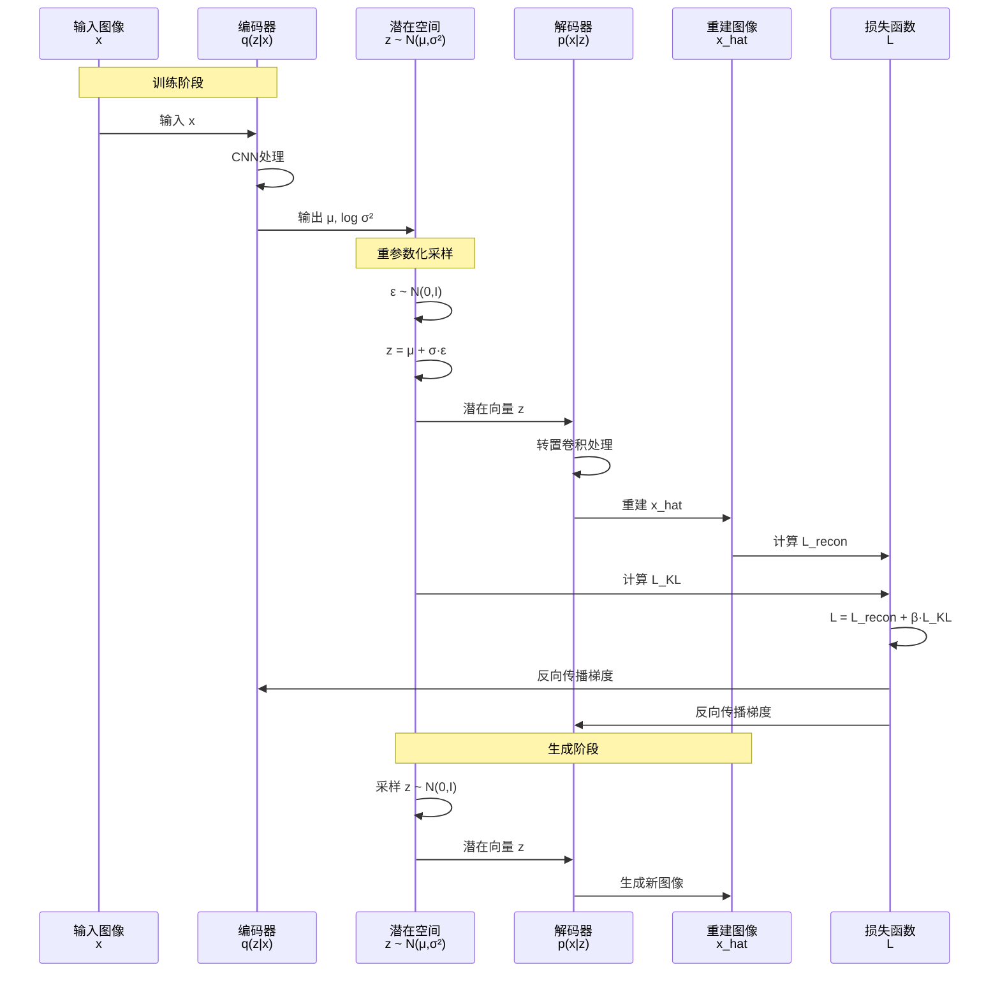

  想象你要给朋友描述一张猫的照片：

  **传统方法：**
  ```
  "第1个像素是(255,128,64)，第2个像素是(128,255,32)..."
  → 说1000万个数字（太长了！）
  ```

  **VAE方法：**
  ```
  "一只橘猫，蹲着，背景是草地，阳光从左边照"
  → 只需几个关键特征（压缩了！）
  ```

  朋友听到描述，脑补出一张类似的猫照片 → 这就是解码

  ---

  **核心流程：**

  ```
  编码器（Encoder）：
  输入：猫的照片（512×512像素 = 262,144个数字）
    ↓
  分析："这是一只橘猫，蹲着，草地背景..."
    ↓
  压缩成：[0.2, -0.5, 0.8, 1.2]（只有4个数字！）
    ↓
  这叫"潜在向量"（Latent Vector）

  ---

  解码器（Decoder）：
  输入：[0.2, -0.5, 0.8, 1.2]
    ↓
  解读："0.2表示橘色，-0.5表示蹲姿，0.8表示草地..."
    ↓
  重建：生成一张猫的照片（512×512像素）
    ↓
  输出：重建的猫照片（和原图很像）
  ```

  ---

  **为什么叫"变分"（Variational）？**

  **普通自编码器：**
  ```
  猫照片 → 编码 → [0.2, -0.5, 0.8, 1.2]（固定的）
  → 解码 → 猫照片
  ```
  - 问题：只能重建，不能生成新猫

  **VAE（变分自编码器）：**
  ```
  猫照片 → 编码 → 均值[0.2, -0.5, 0.8, 1.2] + 方差[0.1, 0.2, 0.1, 0.3]
  → 从分布采样 → [0.25, -0.48, 0.82, 1.15]（有随机性）
  → 解码 → 猫照片（略有不同）
  ```
  - 好处：可以随机生成新猫！

  **关键：学习的是分布，而不是固定值**

  ---

  **VAE的两个魔法：**

  **1. 压缩（降维）**
  ```
  原始图片：512×512×3 = 786,432个数字
  潜在向量：256个数字

  压缩了3000多倍！
  ```

  **2. 生成新内容**
  ```
  随机采样：z ~ N(0, 1)
  → 随机潜在向量：[0.3, -0.7, 1.2, ...]
  → 解码器
  → 生成全新的猫照片（从未见过的）
  ```

  ---

  **实际应用：**

  **1. Stable Diffusion的核心**
  ```
  VAE Encoder：图片 → 潜在空间（缩小8倍）
  Diffusion：在潜在空间做去噪（速度快64倍）
  VAE Decoder：潜在空间 → 图片
  ```

  **2. 图像压缩**
  ```
  原图10MB → VAE编码 → 潜在向量100KB
  → 传输
  → VAE解码 → 重建图片（质量损失小）
  ```

  **3. 数据增强**
  ```
  训练数据：1000张猫照片
  VAE生成：10000张新猫照片
  → 用于训练其他模型
  ```

  ---

  **VAE的数学本质（简化版）：**

  **编码器输出两个东西：**
  ```
  μ（均值）：描述"这只猫的平均特征"
  σ（标准差）：描述"特征的不确定性"

  例如：
  μ = [0.2, -0.5, 0.8]  ← 橘猫的典型特征
  σ = [0.1, 0.2, 0.1]  ← 允许一点变化
  ```

  **采样（重参数化技巧）：**
  ```
  z = μ + σ * ε

  其中：
  ε ~ N(0, 1)  ← 随机噪声

  这样z每次都不同，生成的猫也不同
  ```

  **损失函数：**
  ```
  总损失 = 重建损失 + KL散度

  1. 重建损失：生成的图和原图要像
     L_recon = ||x - x̂||²

  2. KL散度：强制潜在向量接近标准正态分布
     L_KL = KL(q(z|x) || N(0,1))

     目的：让潜在空间"平滑"，随机采样才有意义
  ```

  ---

  **VAE vs 其他生成模型：**

  | 模型 | 生成质量 | 速度 | 训练难度 | 用途 |
  |------|---------|------|---------|------|
  | **VAE** | 中 | 快 | 简单 | 压缩、生成 |
  | **GAN** | 高 | 快 | 难 | 高质量生成 |
  | **Diffusion** | 最高 | 慢 | 中 | 高质量生成 |
  | **Flow** | 中 | 中 | 中 | 密度估计 |

  ---

  **VAE的潜在空间（Latent Space）：**

  **什么是潜在空间？**

  想象一个"猫特征地图"：
  ```
  维度1（x轴）：颜色（0=黑，1=橘，2=白）
  维度2（y轴）：姿势（0=趴，1=蹲，2=站）
  维度3（z轴）：背景（0=室内，1=草地，2=沙发）

  每只猫都是这个空间的一个点：
  - 橘猫+蹲姿+草地 = [1.0, 1.0, 1.0]
  - 黑猫+趴着+沙发 = [0.0, 0.0, 2.0]
  ```

  **平滑性（VAE的关键优势）：**
  ```
  点A：橘猫蹲姿
  点B：黑猫趴姿

  A和B之间的点：
  - 50%处：浅橘色猫，半蹲
  - 75%处：深橘色猫，快趴下

  → 可以"插值"生成中间状态的猫
  ```

  ---

  **常见误区：**

  **误区1："VAE就是压缩工具"**
  - 不只是压缩！更重要的是"可生成"
  - 学习到的潜在空间有意义、可插值

  **误区2："VAE生成质量不如GAN"**
  - 对！但VAE更稳定、训练简单
  - Stable Diffusion用VAE压缩，用Diffusion生成（取长补短）

  **误区3："潜在向量越小越好"**
  - 不对！太小损失信息，太大浪费计算
  - 需要平衡：通常128-512维

  说白了，VAE就是"智能压缩器"——不仅能压缩数据，还能学到数据的"本质"（潜在空间），从而生成新数据。虽然生成质量不如GAN/Diffusion，但作为Stable Diffusion的"压缩引擎"发挥着关键作用。
---


<!-- TODO: 添加VAE架构图，展示Encoder-Latent Space-Decoder结构 -->


VAE：聪明的压缩与还原，把数据变成简洁的“潜在密码”，再优雅地解码出来。

## 为什么它重要（≤5min）
- 让大数据变轻巧：低维潜在空间承载语义。
- 随机采样能生图：生成与插值变自然。

## 怎么做（核心三步）
- 编码：学到 `μ, σ`，描述潜在分布。
- 采样：`z = μ + σ·ε`，带点随机。
- 解码：`z → 图像`，尽量重建接近原图。


## 优缺点（一句到位）
- 优点：稳定、可插值、可生成。
- 缺点：画面偏柔；KL权衡不好会“后验崩塌”。

## 易错点（别踩坑）
- 一味追小维度：太小会丢语义；128–512按任务选。
- 只当压缩器：潜在空间是宝地，可做编辑与插值。

## 适用场景（马上用得上）
- Stable Diffusion 的压缩层（64×64×4）
- 数据增强 / 异常检测

## 参考图源（供重绘或嵌入）
- 常见VAE架构示意（可参考ML Glossary与学术插图进行SVG重绘）

## 一页总结
- `μ/σ/采样/解码`四件套掌握即会用。
- 作为扩散的好搭档：先压缩再扩散、速度质量双赢。

## 核心概念

### VAE的设计思想

**问题：** 如何学习数据的紧凑表示并生成新数据？

**传统自编码器（AE）的问题：**
```
输入 → 编码器 → 固定的code → 解码器 → 重建

问题：
- 潜在空间不连续（只能重建，不能生成）
- 过拟合（每个输入对应一个固定code）
- 无法随机采样生成
```

**VAE的解决方案：**
```
输入 → 编码器 → 分布参数(μ, σ) → 采样z → 解码器 → 重建

优势：
- 潜在空间连续、平滑
- 可以随机采样生成新数据
- 正则化防止过拟合
```

### 核心组件

**编码器（Encoder）：**
- 功能：将输入x映射到潜在分布的参数（均值μ和方差σ²）
- 输出：q(z|x) = N(μ, σ²)
- 目标：学习数据的压缩表示

**潜在空间（Latent Space）：**
- 功能：低维连续空间，表示数据的本质特征
- 特点：平滑、可插值、有语义意义
- 维度：通常128-512维（远小于原始数据）

**解码器（Decoder）：**
- 功能：从潜在向量z重建数据
- 输出：p(x|z)
- 目标：高质量重建

## 工作流程

### 完整流程示意

**训练阶段：**

步骤1：编码

输入图像 x（512×512×3 = 786,432维）经过编码器网络（CNN）处理，输出两个向量：
- 均值 $\mu = [0.2, -0.5, 0.8, ...]$（256维）
- 对数方差 $\log \sigma^2 = [-1.2, -0.8, -1.5, ...]$（256维）

表示分布 $q(z|x) = \mathcal{N}(\mu, \sigma^2)$

---

步骤2：重参数化采样（Reparameterization Trick）

从标准正态分布采样：$\varepsilon \sim \mathcal{N}(0, I)$

重参数化：$z = \mu + \sigma \cdot \varepsilon$

关键优势：
- $\varepsilon$ 是随机的（提供多样性）
- $\mu$ 和 $\sigma$ 是可微的（可以反向传播）

---

步骤3：解码

潜在向量 z（256维）经过解码器网络（转置卷积）处理，重建图像 $\hat{x}$（512×512×3）

---

步骤4：计算损失

总损失函数：

```math
L = L_{recon} + \beta \cdot L_{KL}
```

**1. 重建损失（Reconstruction Loss）：**

```math
L_{recon} = \|x - \hat{x}\|^2 \quad \text{或} \quad -\log p(x|z)
```

目标：重建图像要和原图接近

**2. KL散度（KL Divergence）：**

```math
L_{KL} = \text{KL}(q(z|x) \| p(z)) = -\frac{1}{2} \sum(1 + \log \sigma^2 - \mu^2 - \sigma^2)
```

目标：让 $q(z|x)$ 接近先验 $p(z)=\mathcal{N}(0,I)$

作用：正则化潜在空间，保证平滑性

**3. $\beta$ 参数：**
- $\beta=1$：标准VAE
- $\beta>1$：β-VAE（更平滑的潜在空间，但重建质量下降）

---

**生成阶段：**

步骤1：随机采样

从标准正态分布采样潜在向量：

```math
z \sim \mathcal{N}(0, I)
```

---

步骤2：解码

潜在向量 z 经过解码器生成新图像 $\hat{x}$

---

步骤3：插值生成（可选）

通过插值两个潜在向量，可以生成平滑过渡的图像序列：

```python
# 获取两个图像的潜在向量
z1 = encoder(image_A)  # 猫A的潜在向量
z2 = encoder(image_B)  # 猫B的潜在向量

# 插值生成中间图像
for t in [0, 0.1, 0.2, ..., 1.0]:
    z_t = (1-t) * z1 + t * z2
    x_t = decoder(z_t)
    # x_t 是从猫A到猫B的平滑过渡图像
```

### VAE 时序图



## 数学原理

### 变分推断（Variational Inference）

**目标：** 最大化数据对数似然

```math
\log p(x) = \log \int p(x,z) dz = \log \int p(x|z)p(z) dz
```

问题：积分难以计算

**解决方案：** 变分下界（ELBO）

```math
\log p(x) \geq \text{ELBO}(q) = \mathbb{E}_q[\log p(x|z)] - \text{KL}(q(z|x) \| p(z))
```

```math
= \text{重建项} - \text{正则项}
```

**推导：**

```math
\log p(x) = \log \int p(x|z)p(z) dz
```

```math
= \log \int q(z|x) \cdot \frac{p(x|z)p(z)}{q(z|x)} dz
```

```math
\geq \int q(z|x) \log \left[\frac{p(x|z)p(z)}{q(z|x)}\right] dz \quad \text{（Jensen不等式）}
```

```math
= \mathbb{E}_q[\log p(x|z)] - \text{KL}(q(z|x) \| p(z))
```

### 重参数化技巧（Reparameterization Trick）

**问题：** 采样操作 $z \sim q(z|x)$ 不可微

**解决方案：**

原来：$z \sim \mathcal{N}(\mu, \sigma^2)$ ← 不可微

改为：
- $\varepsilon \sim \mathcal{N}(0, I)$ ← 随机性移到 $\varepsilon$
- $z = \mu + \sigma \cdot \varepsilon$ ← 可微！

梯度：

```math
\frac{\partial L}{\partial \mu} = \frac{\partial L}{\partial z} \cdot \frac{\partial z}{\partial \mu} = \frac{\partial L}{\partial z} \cdot 1
```

```math
\frac{\partial L}{\partial \sigma} = \frac{\partial L}{\partial z} \cdot \frac{\partial z}{\partial \sigma} = \frac{\partial L}{\partial z} \cdot \varepsilon
```

## VAE变体

### β-VAE

**目标：** 学习更解耦的表示

```math
L = L_{recon} + \beta \cdot L_{KL}
```

$\beta > 1$ → 强制更强的正则化

**效果：**
- 潜在空间每个维度对应独立的语义特征
- 例如：dim1=颜色，dim2=形状，dim3=大小

**代价：** 重建质量下降

### VQ-VAE（Vector Quantized VAE）

**创新：** 离散潜在空间

```
编码器 → 连续向量
  ↓
向量量化（查找最近的codebook向量）
  ↓
离散code
  ↓
解码器
```

**优势：**
- 避免"后验崩塌"
- 更清晰的潜在表示
- 用于DALL-E、MagVIT

### Conditional VAE（CVAE）

**功能：** 条件生成

```
编码器输入：x + 条件c（如类别标签）
解码器输入：z + 条件c

生成时指定条件：
  c = "猫" → 生成猫的图像
  c = "狗" → 生成狗的图像
```

## 实际应用案例

### 案例1：Stable Diffusion中的VAE

**角色：** 压缩引擎

```
训练阶段：
  图像（512×512×3）→ VAE Encoder → 潜在表示（64×64×4）
  训练Diffusion模型在64×64×4空间
  潜在表示 → VAE Decoder → 重建图像

生成阶段：
  Diffusion生成潜在表示（64×64×4）
  → VAE Decoder → 图像（512×512×3）
```

**好处：**
- Diffusion在小空间运行 → 快64倍
- VAE提前训练好，固定使用

**VAE细节：**
- 压缩比：8x（空间维度）
- 潜在维度：4通道
- 模型：KL-regularized autoencoder

### 案例2：人脸生成

**任务：** 生成多样化人脸

```python
# 伪代码
import torch
from vae_model import VAE

model = VAE(latent_dim=256)
model.load_state_dict(torch.load('face_vae.pth'))

# 随机生成
z = torch.randn(1, 256)  # 采样潜在向量
face = model.decode(z)   # 生成人脸

# 属性编辑（潜在空间插值）
z1 = model.encode(face1)  # 编码人脸1
z2 = model.encode(face2)  # 编码人脸2

# 混合
alpha = 0.5
z_mix = alpha * z1 + (1-alpha) * z2
face_mix = model.decode(z_mix)  # 混合人脸
```

### 案例3：异常检测

**思想：** 正常数据重建误差小，异常数据重建误差大

```
训练：只用正常数据训练VAE

测试：
  正常样本 → 编码 → 解码 → 重建误差小
  异常样本 → 编码 → 解码 → 重建误差大

阈值：重建误差 > τ → 判定为异常
```

## VAE的优势与局限

### 优势

1. **训练稳定**：无对抗训练，收敛可靠
2. **理论完备**：有明确的概率解释
3. **潜在空间平滑**：可插值、可控编辑
4. **高效压缩**：适合作为其他模型的压缩层

### 局限

1. **生成质量一般**：图像较模糊（后验崩塌问题）
2. **潜在空间维度选择困难**：太小损失信息，太大浪费计算
3. **KL散度与重建质量的权衡**：β难以调优

## 常见问题

**Q: 为什么VAE生成的图像比GAN模糊？**

A:
- **原因1**：重建损失用L2范数 → 倾向生成"平均"图像
- **原因2**：KL正则化约束 → 潜在空间过于平滑
- **解决方案**：使用感知损失（Perceptual Loss）替代L2

**Q: 后验崩塌（Posterior Collapse）是什么？**

A:
- **现象**：KL散度→0，解码器忽略潜在向量z
- **原因**：解码器过强，不需要z也能生成
- **解决方案**：
  - KL退火（从0逐渐增加β）
  - Free bits（给KL设置最小阈值）
  - 使用更强的先验

**Q: VAE和AE的本质区别？**

A:
| 特性 | AE | VAE |
|------|-----|-----|
| **编码输出** | 固定向量 | 分布参数(μ,σ) |
| **潜在空间** | 离散、不连续 | 连续、平滑 |
| **生成能力** | 无 | 有 |
| **训练目标** | 重建 | 重建+正则化 |

**Q: 如何选择潜在维度？**

A:
- **经验值**：
  - 小图像（64×64）：128维
  - 中图像（256×256）：256维
  - 大图像（512×512）：512维
- **方法**：逐步增加维度，观察重建质量饱和点

## 参考资料

- [Auto-Encoding Variational Bayes](https://arxiv.org/abs/1312.6114) - VAE原论文
- [β-VAE: Learning Basic Visual Concepts with a Constrained Variational Framework](https://openreview.net/forum?id=Sy2fzU9gl)
- [Neural Discrete Representation Learning](https://arxiv.org/abs/1711.00937) - VQ-VAE论文
- [什么是Diffusion Model](/guide/video/generation/what-is-diffusion-model) - 本站相关文章
- [什么是表示空间](/guide/ai/what-is-representation-space) - 本站相关文章
