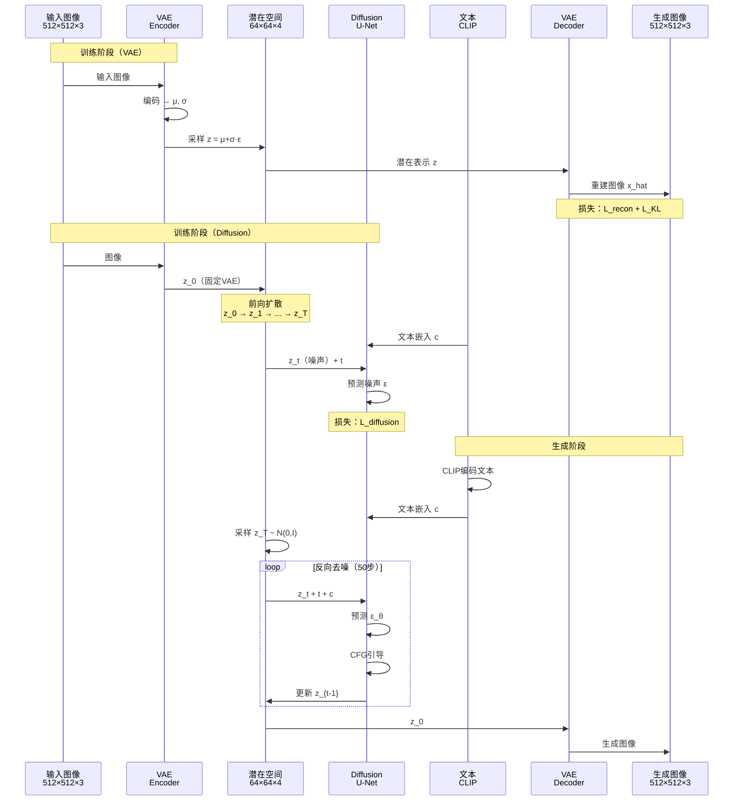

  **传统Diffusion（DDPM）：**
  ```
  在像素空间做扩散：
    图片：512×512×3 = 786,432个像素
    扩散：对78万个数字做1000次去噪
    计算量：78万 × 1000 = 7.8亿次操作
    显存：需要存储78万维的中间状态
    速度：慢（几十秒/张）
  ```

  **Latent Diffusion（Stable Diffusion）：**
  ```
  1. VAE压缩：
     图片512×512×3
       ↓ VAE Encoder（压缩8倍）
     潜在表示64×64×4 = 16,384维
     （缩小了48倍！）

  2. 在潜在空间做扩散：
     潜在表示：16,384维
     扩散：对1.6万个数字做50次去噪
     计算量：1.6万 × 50 = 80万次操作
     （减少了近1000倍！）

  3. VAE解码：
     潜在表示64×64×4
       ↓ VAE Decoder（解压8倍）
     图片512×512×3

  结果：
    速度：快64倍（2-5秒/张）
    显存：省64倍
    质量：几乎不损失
  ```

  ---

  **核心流程（Stable Diffusion为例）：**

  ```
  训练阶段：

  步骤1：训练VAE（提前完成，固定使用）

  真实图片x（512×512×3）
    ↓
  VAE Encoder：E(x)
    ↓
  潜在表示z（64×64×4）
    ↓
  VAE Decoder：D(z)
    ↓
  重建图片x̂（512×512×3）

  损失：||x - x̂||²（重建要像）

  训练完成后，冻结VAE参数

  ---

  步骤2：训练Diffusion（在潜在空间）

  潜在表示z（从VAE Encoder得到）
    ↓
  前向扩散（加噪声1000次）：
    z₀ → z₁ → z₂ → ... → z_T（纯噪声）
    ↓
  训练U-Net预测噪声：
    输入：z_t（有噪声的潜在表示）+ 时间步t + 条件c（文本）
    输出：预测的噪声ε

  损失：||ε - ε_θ(z_t, t, c)||²

  ---

  生成阶段：

  步骤1：文本编码

  用户输入："一只戴墨镜的猫"
    ↓
  CLIP Text Encoder
    ↓
  文本嵌入c（77×768维）

  ---

  步骤2：采样噪声

  z_T ~ N(0, I)  ← 随机采样64×64×4的噪声

  ---

  步骤3：反向去噪（在潜在空间）

  for t = T to 1:
    # U-Net预测噪声
    ε_pred = U-Net(z_t, t, c)

    # 去噪一步
    z_{t-1} = (z_t - β_t·ε_pred) / √(1-β_t) + σ_t·噪声

  得到：z₀（去噪后的潜在表示）

  ---

  步骤4：VAE解码

  z₀（64×64×4）
    ↓
  VAE Decoder
    ↓
  生成图片（512×512×3）
  ```

  ---

  **为什么在潜在空间做扩散？**

  **1. 计算效率：**
  ```
  像素空间：
    - 维度：512×512×3 = 786,432
    - U-Net复杂度：O(H²W²)
    - 单次去噪：~2秒

  潜在空间（缩小8倍）：
    - 维度：64×64×4 = 16,384
    - U-Net复杂度：O((H/8)²(W/8)²) = O(H²W²/64)
    - 单次去噪：~0.03秒

  加速比：64倍
  ```

  **2. 显存效率：**
  ```
  像素空间：
    - 中间激活：~10GB显存
    - 需要：A100（80GB）

  潜在空间：
    - 中间激活：~2GB显存
    - 可用：RTX 3060（12GB）

  → 消费级GPU可运行
  ```

  **3. 语义压缩：**
  ```
  VAE学到的潜在空间：
    - 去掉了高频噪声（像素级细节）
    - 保留了语义信息（物体、布局、风格）

  好处：
    - Diffusion专注于语义生成
    - 细节由VAE Decoder恢复
    - 更稳定、更高效
  ```

  ---

  **Latent Diffusion的架构（Stable Diffusion）：**

  **组件1：VAE（固定，预训练）**
  ```
  Encoder：
    输入：512×512×3
    架构：卷积层（逐步下采样）
    输出：64×64×4（均值 + 对数方差）

  Decoder：
    输入：64×64×4
    架构：转置卷积层（逐步上采样）
    输出：512×512×3

  训练：
    损失 = 重建损失 + KL散度
    数据集：大规模图像（如ImageNet）
  ```

  **组件2：U-Net（可训练，Diffusion核心）**
  ```
  输入：
    - z_t（64×64×4，有噪声的潜在表示）
    - t（时间步）
    - c（文本嵌入，77×768）

  架构：
    - 下采样路径：
      64×64 → 32×32 → 16×16 → 8×8
      每层：卷积 + ResNet Block + Attention

    - 上采样路径：
      8×8 → 16×16 → 32×32 → 64×64
      每层：转置卷积 + ResNet Block + Attention

    - Cross-Attention：
      在每层融合文本嵌入c
      Q：图像特征，K/V：文本嵌入

  输出：
    预测的噪声ε（64×64×4）
  ```

  **组件3：Text Encoder（固定，CLIP）**
  ```
  输入：
    文本："一只戴墨镜的猫"
    ↓
    Tokenize：[a, cat, wearing, sunglasses, ...]
    ↓
    CLIP Text Encoder（12层Transformer）

  输出：
    文本嵌入（77×768）
    - 77：最大token数
    - 768：CLIP文本嵌入维度
  ```

  ---

  **Latent Diffusion vs Pixel Diffusion：**

  | 特性 | Pixel Diffusion | Latent Diffusion |
  |------|----------------|-----------------|
  | **空间** | 像素空间（RGB） | 潜在空间（VAE压缩） |
  | **维度** | 512×512×3 = 786K | 64×64×4 = 16K |
  | **速度** | 慢 | 快64倍 |
  | **显存** | 大（~10GB） | 小（~2GB） |
  | **质量** | 高（直接生成像素） | 高（VAE损失小） |
  | **硬件要求** | 数据中心GPU | 消费级GPU |
  | **代表模型** | DALL-E 2 Decoder | Stable Diffusion |

  ---

  **Classifier-Free Guidance（无分类器引导）：**

  **问题：** 如何让生成图片更符合文本？

  **解决方案：**
  ```
  训练时：
    - 15%的时间，丢弃文本条件（c = ∅）
    - 85%的时间，使用文本条件（c = text）

  训练两种模式：
    - 有条件模型：ε_θ(z_t, t, c)
    - 无条件模型：ε_θ(z_t, t, ∅)

  ---

  生成时：
    ε_guided = ε_θ(z_t, t, ∅) + w · (ε_θ(z_t, t, c) - ε_θ(z_t, t, ∅))

    其中：
    - w：引导强度（通常7.5）
    - w=1：普通条件生成
    - w>1：更强的文本引导（更符合提示，但多样性降低）
    - w=0：无条件生成（忽略文本）

  效果：
    w=1："一只猫"（可能是各种猫）
    w=7.5："一只猫"（更清晰、更符合期待的猫）
    w=15："一只猫"（过度强调，可能过饱和）
  ```

  ---

  **实际应用：**

  **1. Stable Diffusion（文生图）**
  ```
  输入："sunset over the ocean, oil painting"
  处理流程：
    文本 → CLIP → 文本嵌入
    随机噪声 → U-Net去噪50步（潜在空间）
    潜在表示 → VAE Decoder → 图片

  时间：2-5秒（RTX 3090）
  ```

  **2. ControlNet（可控生成）**
  ```
  基于Latent Diffusion，添加额外控制：
    - 边缘图（Canny）
    - 姿势（OpenPose）
    - 深度图（MiDaS）
    - 语义分割图

  流程：
    文本 + 控制图 → U-Net → 生成符合控制的图像
  ```

  **3. DreamBooth（个性化微调）**
  ```
  任务：生成"我的狗"

  方法：
    - 提供3-5张你的狗的照片
    - 微调Latent Diffusion的U-Net
    - 学习特殊token（如[V]）

  生成：
    "a [V] dog on the beach" → 生成你的狗在海滩上
  ```

  **4. Image-to-Image**
  ```
  任务：修改图片风格

  方法：
    原图 → VAE Encoder → z₀
    添加少量噪声 → z_t（t较小，如t=500）
    文本引导去噪 → z₀'
    VAE Decoder → 新图片

  例子：
    输入图：猫的照片
    提示："oil painting"
    输出：猫的油画风格图
  ```

  ---

  **常见误区：**

  **误区1："Latent Diffusion质量不如Pixel Diffusion"**
  - 不对！VAE的重建损失很小
  - Stable Diffusion质量接近DALL-E 2
  - 关键是VAE训练得好

  **误区2："潜在空间就是低分辨率"**
  - 不完全对！潜在空间不是简单缩放
  - VAE学到的是语义压缩
  - 64×64×4的潜在空间包含512×512×3的语义信息

  **误区3："Latent Diffusion只能用于图像"**
  - 不对！可以扩展到视频、音频、3D
  - 只要有合适的VAE压缩方法

  说白了，Latent Diffusion就是"压缩空间的扩散"——通过VAE压缩，在小空间做扩散，速度快64倍还不损失质量，让Stable Diffusion能在消费级GPU上运行，是Diffusion模型走向大众的关键技术。
---


<!-- TODO: 添加Latent Diffusion流程图，展示VAE压缩-潜在空间扩散-VAE解码 -->


潜在扩散：先把图像缩成“语义小宇宙”，在小宇宙里去噪，再放大回现实——快、省，还靠谱。

## 为什么它重要（≤5min）
- 像素太大、算力太贵：在像素空间做扩散既慢又费显存。
- 先压缩再生成：把图像压成语义浓缩的潜在表示，扩散在小空间里完成。
- 结果：速度↑、显存↓、质量稳，消费级GPU也能跑。

## 怎么做（一图一流程）
- 入口：`图像 → VAE Encoder → z（64×64×4）`
- 去噪：`z_T ~ N(0,I) → 反向去噪(DDIM 50步) → z_0`
- 出口：`z_0 → VAE Decoder → 图像`
- 文本条件：CLIP文本嵌入通过 Cross-Attention 注入到U-Net/DiT。


## 优缺点（一句到位）
- 优点：快、省、稳，语义先行、细节后补。
- 缺点：依赖好用的VAE；VAE训练差会拖画质后腿。

## 易错点（别踩坑）
- 把“潜在空间”当低清缩放：错，VAE学的是语义压缩，不是简单降分辨率。
- 以为只能做图像：视频/音频/3D都可拓展（需对应的3D/时序VAE）。

## 适用场景（马上用得上）
- 文生图：Stable Diffusion 家族
- 可控生成：ControlNet（边缘/姿势/深度等多信号）
- 个性化微调：DreamBooth / LoRA

## 参考图源（供重绘或嵌入）
- Stable Diffusion 论文管线图（建议参考重绘为SVG）：Ho et al., 2021（High-Resolution Image Synthesis with LDM）
- HuggingFace Annotated Diffusion 可视化流程图（适合提炼关键形状）（The Annotated Diffusion Model）

## 一页总结
- 小空间做大事：把重计算搬到潜在空间，性能直接起飞。
- 语义与细节分工：扩散管语义，VAE复原细节。
- 选型建议：优先DDIM 20–50步 + 优秀VAE；文本条件用CFG 7.5左右。

### 核心组件

**VAE（Variational Autoencoder）：**
- 功能：图像 ↔ 潜在表示
- 压缩比：通常8倍（512→64）
- 训练：独立预训练，生成时固定

**U-Net（Diffusion Backbone）：**
- 功能：在潜在空间预测噪声
- 输入：噪声潜在表示 + 时间步 + 条件
- 输出：预测的噪声

**Conditioning（条件模块）：**
- 文本：CLIP Text Encoder
- 其他：类别标签、图像、布局等
- 注入方式：Cross-Attention

## 工作流程

### 完整流程示意

**训练阶段：**

```
阶段1：训练VAE（提前完成）

数据集：大规模图像（如ImageNet、LAION）

训练：
  图像x（512×512×3）
    ↓
  Encoder：E(x)
    → μ（64×64×4）：均值
    → logσ²（64×64×4）：对数方差
    ↓
  采样：z = μ + σ * ε（ε ~ N(0,I)）
    ↓
  Decoder：D(z)
    → 重建图像x̂（512×512×3）

  损失：
    L_VAE = L_recon + β·L_KL
    = ||x - x̂||² + β·KL(q(z|x) || N(0,I))

结果：
  - 压缩比：8×（512→64）
  - 潜在维度：4通道
  - 重建质量：PSNR > 25dB

---

阶段2：训练Diffusion（在潜在空间）

数据准备：
  图像x → VAE Encoder → 潜在表示z（64×64×4）

前向扩散：
  z₀ → z₁ → ... → z_T（加噪声）
  q(z_t | z_{t-1}) = N(z_t; √(1-β_t)·z_{t-1}, β_t·I)

训练U-Net：
  输入：
    - z_t：有噪声的潜在表示
    - t：时间步
    - c：条件（如文本嵌入）

  目标：
    预测噪声ε

  损失：
    L_LDM = E_{z,ε,t}[||ε - ε_θ(z_t, t, c)||²]

训练细节：
  - 优化器：AdamW
  - 学习率：1e-4
  - Batch size：256
  - 训练步数：100万-1000万步
```

**生成阶段：**

```
步骤1：文本编码（如果是文生图）

文本："a cat wearing sunglasses"
  ↓
CLIP Text Encoder
  ↓
文本嵌入c（77×768）

---

步骤2：初始化噪声

z_T ~ N(0, I)  ← 采样64×64×4的高斯噪声

---

步骤3：反向去噪（DDIM，50步）

for t = T, T-Δt, ..., 1:
  # U-Net预测噪声
  ε_pred = ε_θ(z_t, t, c)

  # Classifier-Free Guidance
  if w != 1:
    ε_uncond = ε_θ(z_t, t, ∅)
    ε_pred = ε_uncond + w·(ε_pred - ε_uncond)

  # DDIM更新
  z_{t-Δt} = √(α_{t-Δt})·(z_t - √(1-α_t)·ε_pred)/√(α_t)
             + √(1-α_{t-Δt})·ε_pred

---

步骤4：VAE解码

z₀（64×64×4）
  ↓
VAE Decoder：D(z₀)
  ↓
生成图像（512×512×3）
```

### Latent Diffusion时序图



## 架构细节

### VAE架构

**Encoder：**
```
输入：512×512×3

Conv Block 1：
  Conv(3→128, 3×3, stride=1)
  ResNet Blocks × 2

Downsample 1：
  Conv(128→128, 3×3, stride=2) → 256×256×128

Conv Block 2：
  ResNet Blocks × 2
  Conv(128→256, 3×3, stride=1)

Downsample 2：
  Conv(256→256, 3×3, stride=2) → 128×128×256

Conv Block 3：
  ResNet Blocks × 2
  Conv(256→512, 3×3, stride=1)

Downsample 3：
  Conv(512→512, 3×3, stride=2) → 64×64×512

Conv Block 4：
  ResNet Blocks × 2
  Attention Block

输出层：
  Conv(512→8, 3×3) → 64×64×8
  Split → μ(64×64×4), logσ²(64×64×4)
```

**Decoder：**
```
输入：64×64×4

Conv Block 1：
  Conv(4→512, 3×3)
  Attention Block
  ResNet Blocks × 2

Upsample 1：
  Interpolate(2×) → 128×128×512
  Conv(512→512, 3×3)

Conv Block 2：
  ResNet Blocks × 2
  Conv(512→256, 3×3)

Upsample 2：
  Interpolate(2×) → 256×256×256
  Conv(256→256, 3×3)

Conv Block 3：
  ResNet Blocks × 2
  Conv(256→128, 3×3)

Upsample 3：
  Interpolate(2×) → 512×512×128
  Conv(128→128, 3×3)

输出层：
  ResNet Blocks × 2
  Conv(128→3, 3×3) → 512×512×3
```

### U-Net架构（在潜在空间）

**输入：**
```
- z_t：64×64×4（噪声潜在表示）
- t：时间步（标量）
- c：文本嵌入（77×768）
```

**架构：**
```
时间步嵌入：
  t → SinusoidalPositionEmbedding
    → MLP(512→1280) → t_emb

下采样路径：
  输入：64×64×4

  Level 1（64×64）：
    Conv(4→320, 3×3)
    ResBlock(320) + Attention + CrossAttention(c) × 2
    Downsample(320) → 32×32×320

  Level 2（32×32）：
    ResBlock(320→640) + Attention + CrossAttention(c) × 2
    Downsample(640) → 16×16×640

  Level 3（16×16）：
    ResBlock(640→1280) + Attention + CrossAttention(c) × 2
    Downsample(1280) → 8×8×1280

中间层（8×8）：
  ResBlock(1280) + Attention + CrossAttention(c)
  ResBlock(1280)

上采样路径：
  Level 3（8×8→16×16）：
    Upsample(1280) → 16×16×1280
    Concat(skip connection from down)
    ResBlock(1280→1280) + Attention + CrossAttention(c) × 2

  Level 2（16×16→32×32）：
    Upsample(1280) → 32×32×1280
    Concat(skip connection)
    ResBlock(1280→640) + Attention + CrossAttention(c) × 2

  Level 1（32×32→64×64）：
    Upsample(640) → 64×64×640
    Concat(skip connection)
    ResBlock(640→320) + Attention + CrossAttention(c) × 2

输出：
  Conv(320→4, 3×3) → 64×64×4（预测噪声）
```

**Cross-Attention（融合文本）：**
```
输入：
  - Q：图像特征（H×W×C）
  - K, V：文本嵌入（77×768）

计算：

```math
\text{Attention}(Q, K, V) = \text{softmax}\left(\frac{QK^T}{\sqrt{d}}\right) V
```

作用：
  让图像每个位置关注文本的相关部分
  "猫"的位置关注"cat"token
  "墨镜"的位置关注"sunglasses"token

## Classifier-Free Guidance

### 原理

**问题：** 如何让生成图片更符合文本？

**传统Classifier Guidance：**

需要额外训练分类器：

```math
\varepsilon_{guided} = \varepsilon_\theta(z_t, t) - s \cdot \nabla \log p(c|z_t)
```

问题：
- 需要额外分类器
- 训练成本高

**Classifier-Free Guidance（CFG）：**

核心思想：同时训练有条件和无条件模型

训练：
  随机丢弃条件（概率p=0.1-0.15）：
    if random() < 0.1:
      c = ∅  # 无条件
    else:
      c = text_embedding  # 有条件

  训练同一个U-Net学会两种模式

生成：

  ```math
  \varepsilon_{cond} = \varepsilon_\theta(z_t, t, c) \quad \text{（有条件预测）}
  ```

  ```math
  \varepsilon_{uncond} = \varepsilon_\theta(z_t, t, \emptyset) \quad \text{（无条件预测）}
  ```

  ```math
  \varepsilon_{guided} = \varepsilon_{uncond} + w \cdot (\varepsilon_{cond} - \varepsilon_{uncond})
  ```

  其中 $w$ 是引导强度
```

### 引导强度w的影响

| w | 效果 | 优点 | 缺点 |
|---|------|------|------|
| 1.0 | 标准条件生成 | 平衡 | - |
| 3.0 | 弱引导 | 多样性高 | 可能偏离提示 |
| 7.5 | 标准引导（默认） | 符合提示 | - |
| 15.0 | 强引导 | 严格符合提示 | 过饱和、细节少 |
| 20.0+ | 过强引导 | - | 图像失真 |

**实验示例：**
```
提示："a red cube and a blue sphere"

w=1.0：可能生成蓝立方体和红球（混淆）
w=7.5：生成红立方体和蓝球（正确）
w=15：生成红立方体和蓝球，但颜色过饱和
```

## 性能分析

### 计算复杂度对比

**Pixel Diffusion（512×512）：**
```
U-Net FLOPs（单步）：~200 GFLOPs
去噪步数：1000步（DDPM）或50步（DDIM）
总计：
  - DDPM：200G × 1000 = 200 TFLOPs
  - DDIM：200G × 50 = 10 TFLOPs

时间（A100）：
  - DDPM：~60秒
  - DDIM：~3秒
```

**Latent Diffusion（64×64潜在空间）：**
```
U-Net FLOPs（单步）：~3 GFLOPs（小64倍）
去噪步数：50步（DDIM）
VAE Decoder：~1 GFLOPs
总计：3G × 50 + 1G = 151 GFLOPs

时间（A100）：~0.5秒
时间（RTX 3090）：~2秒

加速比：60÷2 = 30倍（实际）
```

### 显存占用对比

| 模型 | 中间激活 | 模型参数 | 总显存 | 最低GPU |
|------|---------|---------|--------|---------|
| Pixel Diffusion | ~8GB | ~2GB | ~10GB | A6000 |
| Latent Diffusion | ~1.5GB | ~1GB | ~3GB | RTX 3060 |

## 实际应用

### Stable Diffusion

**版本演进：**
```
SD 1.4（2022.8）：
  - U-Net：860M参数
  - VAE：84M参数
  - 训练数据：LAION-5B过滤

SD 1.5（2022.10）：
  - 更多训练步数
  - 更好的美学质量

SD 2.0（2022.11）：
  - 更大的文本编码器（OpenCLIP）
  - 768×768分辨率

SD 2.1（2022.12）：
  - 修复SD 2.0的问题
  - 更稳定的生成

SDXL（2023.7）：
  - U-Net：2.6B参数
  - 双文本编码器（CLIP + OpenCLIP）
  - 1024×1024分辨率
```

### ControlNet

**原理：** 在Latent Diffusion基础上添加空间控制

```
控制信号：
  - Canny边缘图
  - 深度图（MiDaS）
  - 姿势（OpenPose）
  - 语义分割图
  - 法线图
  - 线稿

架构：
  ControlNet：复制U-Net的编码器
    - 接收控制图作为输入
    - 输出注入到原U-Net

训练：
  - 冻结原U-Net
  - 只训练ControlNet
  - 保留文生图能力
```

**使用：**
```python
# 伪代码
from diffusers import StableDiffusionControlNetPipeline, ControlNetModel

controlnet = ControlNetModel.from_pretrained("lllyasviel/sd-controlnet-canny")
pipe = StableDiffusionControlNetPipeline.from_pretrained(
    "runwayml/stable-diffusion-v1-5",
    controlnet=controlnet
)

canny_image = get_canny_edges(input_image)
output = pipe(
    prompt="a cat",
    image=canny_image,
    num_inference_steps=50
).images[0]
```

### DreamBooth

**目标：** 个性化微调（学习特定主体）

```
数据：
  - 3-5张目标主体的照片
  - 特殊标识符：[V]

训练：
  损失 = L_reconstruction + λ·L_prior

  L_reconstruction：
    "a [V] dog" → 生成你的狗
    ||ε - ε_θ(z_t, t, "a [V] dog")||²

  L_prior（防止过拟合）：
    "a dog" → 生成普通狗
    ||ε - ε_θ(z_t, t, "a dog")||²

结果：
  - [V]绑定到你的狗
  - 可生成任意场景下的你的狗
```

## 常见问题

**Q: 为什么VAE压缩比是8倍？**

A:
- 经验选择（实验发现8倍平衡质量和速度）
- 4倍：质量好但速度提升不够
- 16倍：速度快但质量下降明显

**Q: 潜在空间的4个通道是什么？**

A:
- 不是RGB+Alpha
- 是VAE学到的抽象特征
- 没有明确语义（类似PCA的主成分）

**Q: Latent Diffusion能用于视频吗？**

A:
- 可以！需要3D VAE（时空压缩）
- Stable Video Diffusion就是这样做的
- 挑战：时间一致性

**Q: 为什么CFG的w通常是7.5？**

A:
- 经验值（在Stable Diffusion上实验得出）
- 平衡文本符合度和图像质量
- 不同模型最优值可能不同

## 参考资料

- [High-Resolution Image Synthesis with Latent Diffusion Models](https://arxiv.org/abs/2112.10752) - Latent Diffusion原论文
- [Classifier-Free Diffusion Guidance](https://arxiv.org/abs/2207.12598)
- [Adding Conditional Control to Text-to-Image Diffusion Models](https://arxiv.org/abs/2302.05543) - ControlNet论文
- [DreamBooth: Fine Tuning Text-to-Image Diffusion Models](https://arxiv.org/abs/2208.12242)
- [什么是Diffusion Model](/guide/video/generation/what-is-diffusion-model) - 本站相关文章
- [什么是VAE](/guide/video/generation/what-is-VAE) - 本站相关文章
