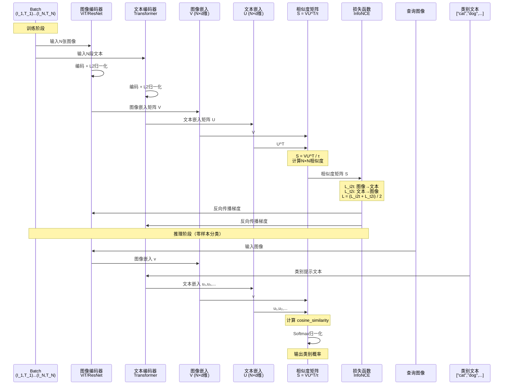

  **传统图像分类：**
  ```
  训练：
    - 图片：猫的照片
    - 标签：类别3（猫）
    - AI学会：这张图 → 类别3

  问题：
    - 只能识别固定类别（如1000类）
    - 不理解语言
    - 无法处理"戴墨镜的猫"这种新描述
  ```

  **CLIP：**
  ```
  训练：
    - 图片：猫的照片
    - 文本："一只橘色的猫在草地上"
    - AI学会：图片和文字的语义对应

  能力：
    - 理解任意文字描述
    - 零样本分类（没见过的类别也能识别）
    - 图文搜索（输入文字找图，或输入图找文字）
  ```

  ---

  **核心流程：**

  ```
  步骤1：准备数据（4亿图文对）

  图片1：[猫的照片]
  文本1："a photo of a cat"

  图片2：[狗的照片]
  文本2："a photo of a dog"

  ...（4亿对）

  ---

  步骤2：编码

  图像编码器（ViT或ResNet）：
    图片1 → 图像向量1（512维）
    图片2 → 图像向量2（512维）

  文本编码器（Transformer）：
    文本1 → 文本向量1（512维）
    文本2 → 文本向量2（512维）

  ---

  步骤3：对比学习（核心！）

  目标：
    - 匹配对（图片1-文本1）→ 向量要相似（余弦相似度高）
    - 不匹配对（图片1-文本2）→ 向量要不相似（余弦相似度低）

  训练：
    计算相似度矩阵（Batch size=32,768）：
              文本1  文本2  文本3  ...
    图片1      0.9    0.1    0.2   ...  ← 对角线是匹配对（高相似度）
    图片2      0.1    0.8    0.15  ...
    图片3      0.2    0.1    0.85  ...
    ...

  损失函数：
    让对角线（匹配对）相似度尽量高
    让非对角线（不匹配对）相似度尽量低

  ---

  步骤4：训练完成

  结果：
    - 图像向量和文本向量在同一个"语义空间"
    - 语义相近的图文，向量也相近
    - 可以直接计算相似度
  ```

  ---

  **CLIP的超能力：**

  **1. 零样本分类（Zero-Shot Classification）**
  ```
  任务：识别图片是什么

  传统方法：
    - 需要训练1000类的分类器
    - 只能识别这1000类

  CLIP：
    候选类别：["猫", "狗", "鸟", "汽车", ...]
    ↓
    转为文本提示：
      "a photo of a cat"
      "a photo of a dog"
      "a photo of a bird"
      "a photo of a car"
    ↓
    文本编码器 → 文本向量们
    图像编码器 → 图像向量
    ↓
    计算相似度：
      图像 vs "a photo of a cat"：0.85 ← 最高！
      图像 vs "a photo of a dog"：0.2
      图像 vs "a photo of a bird"：0.1
    ↓
    输出：猫

  优势：
    - 不需要重新训练
    - 可以识别任意类别（只要你能描述）
  ```

  **2. 图文搜索**
  ```
  场景1：文搜图
    输入："一只戴墨镜的猫"
    ↓
    文本编码器 → 文本向量
    ↓
    在图片库中找最相似的图像向量
    ↓
    输出：戴墨镜的猫的照片

  场景2：图搜文
    输入：一张风景照
    ↓
    图像编码器 → 图像向量
    ↓
    在文本库中找最相似的文本向量
    ↓
    输出："美丽的日落景色"
  ```

  **3. 多模态理解**
  ```
  任务：判断图文是否匹配

  图片：猫的照片
  文本A："一只猫" → 相似度0.9（匹配）
  文本B："一只狗" → 相似度0.1（不匹配）
  ```

  ---

  **为什么CLIP有效？**

  **关键1：大规模数据（4亿图文对）**
  ```
  传统ImageNet：100万图像，1000类标签
  CLIP：4亿图文对，从互联网收集

  覆盖面：
    - 各种物体、场景、风格
    - 各种语言描述
    - 常见+罕见概念都有
  ```

  **关键2：对比学习（Contrastive Learning）**
  ```
  不是直接预测类别
  而是学习"语义对齐"

  好处：
    - 泛化能力强
    - 理解语言的细微差别
    - 零样本迁移
  ```

  **关键3：Prompt Engineering（提示工程）**
  ```
  不是直接用类别名
  而是用完整句子

  差：
    "cat" → 向量a

  好：
    "a photo of a cat" → 向量b

  原因：
    - 训练时看到的是完整句子
    - 提示越接近训练数据，效果越好

  进阶：
    "a photo of a cat, a type of animal"
    （加上下文信息，效果更好）
  ```

  ---

  **CLIP的应用：**

  **1. Stable Diffusion的文本编码器**
  ```
  用户输入："一只戴墨镜的猫"
    ↓
  CLIP文本编码器
    ↓
  文本嵌入（77×768维）
    ↓
  传给Diffusion模型
    ↓
  生成图像
  ```

  **2. DALL-E 2**
  ```
  CLIP的作用：
    - 图像编码器：理解图像
    - 文本编码器：理解文本
    - Prior网络：文本嵌入 → 图像嵌入
  ```

  **3. 图像检索**
  ```
  Google Photos：
    搜索"海滩"
    ↓
    CLIP文本编码器："海滩"
    ↓
    找相似的图像向量
    ↓
    返回海滩照片
  ```

  **4. 内容审核**
  ```
  检测不当内容：
    文本："暴力场景"
    ↓
    CLIP计算图文相似度
    ↓
    相似度高 → 标记为不当内容
  ```

  ---

  **CLIP的架构：**

  **图像编码器（两种选择）：**
  ```
  选项1：ResNet-50
    - 传统CNN架构
    - 参数量：38M
    - 速度快

  选项2：ViT-L/14
    - Vision Transformer
    - 参数量：307M
    - 效果更好（CLIP论文主推）
  ```

  **文本编码器：**
  ```
  Transformer（类似GPT）
    - 12层
    - 768维隐藏层
    - 63M参数
    - 最大文本长度：77个token
  ```

  **投影层：**
  ```
  图像编码器输出 → 线性投影 → 512维
  文本编码器输出 → 线性投影 → 512维

  目的：统一到同一个嵌入空间
  ```

  ---

  **训练细节：**

  **数据：**
  ```
  数据集：WebImageText（WIT）
    - 4亿图文对
    - 从互联网爬取
    - 过滤规则：
      - 图像分辨率 > 某阈值
      - 文本长度 > 某阈值
      - 去重
  ```

  **损失函数（InfoNCE）：**
  ```
  Batch中有N个图文对：
    (image₁, text₁), (image₂, text₂), ..., (image_N, text_N)

  相似度矩阵：S ∈ R^(N×N)
    S[i,j] = cosine_similarity(image_i, text_j)

  损失（对称）：
    L = L_i2t + L_t2i

    $L_{i2t}$（图像→文本）：
      对每个图像，让它和对应文本相似度最高
      
      ```math
      L_{i2t} = -\log\left(\frac{\exp(S[i,i]/\tau)}{\sum_j \exp(S[i,j]/\tau)}\right)
      ```

    $L_{t2i}$（文本→图像）：
      对每个文本，让它和对应图像相似度最高
      
      ```math
      L_{t2i} = -\log\left(\frac{\exp(S[i,i]/\tau)}{\sum_j \exp(S[j,i]/\tau)}\right)
      ```

    $\tau$：温度参数（可学习，初始0.07）
  ```

  **优化：**
  ```
  优化器：AdamW
  学习率：5e-4（余弦衰减）
  Batch size：32,768（超大！）
  训练：32个Epoch
  硬件：256×V100 GPU，训练2周
  ```

  ---

  **CLIP vs 传统方法：**

  | 特性 | 传统图像分类 | CLIP |
  |------|------------|------|
  | **训练数据** | 标注数据（ImageNet） | 图文对（互联网） |
  | **数据规模** | 100万 | 4亿 |
  | **标注成本** | 高（人工标注） | 低（自动爬取） |
  | **识别类别** | 固定（1000类） | 任意（文本描述） |
  | **零样本能力** | 无 | 有 |
  | **语言理解** | 无 | 有 |
  | **适应新类别** | 需重新训练 | 不需要 |

  ---

  **CLIP的局限：**

  **1. 细粒度分类较弱**
  ```
  任务："区分不同品种的狗"
    - 传统专用分类器：95%准确率
    - CLIP：75%准确率

  原因：
    - CLIP训练数据太泛化
    - 缺少细粒度标注
  ```

  **2. OCR能力弱**
  ```
  任务：识别图片中的文字
    - CLIP：效果差
    - 专用OCR模型：效果好

  原因：
    - 训练时没有专门学习文字识别
  ```

  **3. 数数能力差**
  ```
  任务："图中有几只猫？"
    - CLIP：容易出错
    - 专用计数模型：更准确

  原因：
    - 对比学习不强调精确计数
  ```

  **4. 空间关系理解弱**
  ```
  任务："猫在沙发上还是沙发下？"
    - CLIP：容易混淆
    - 需要更强的视觉推理能力
  ```

  ---

  **CLIP的改进版本：**

  **1. OpenCLIP（开源复现）**
  ```
  改进：
    - 开源代码和权重
    - 支持更多数据集（LAION-5B：50亿图文对）
    - 更大模型（ViT-G：1.8B参数）
  ```

  **2. Chinese CLIP**
  ```
  改进：
    - 中文图文数据（2亿中文图文对）
    - 中文文本编码器
    - 适配中文应用场景
  ```

  **3. CLIP-Surgery**
  ```
  改进：
    - 修复CLIP的背景偏见
    - 提升定位能力
    - 更适合分割任务
  ```

  ---

  **常见误区：**

  **误区1："CLIP是图像分类模型"**
  - 不完全对！CLIP是多模态对齐模型
  - 可以做分类，但不止于分类

  **误区2："CLIP只能做零样本"**
  - 不对！CLIP还能：
    - 微调（在特定任务上）
    - 做特征提取器
    - 做预训练backbone

  **误区3："CLIP理解所有语言"**
  - 不对！原版CLIP主要是英文
  - 其他语言需要专门训练（如Chinese CLIP）

  说白了，CLIP就是"图文翻译官"——通过4亿图文对的对比学习，让AI理解图片和文字的对应关系。虽然在细粒度任务上有局限，但零样本能力和泛化能力极强，成为Stable Diffusion、DALL-E等生成模型的关键组件。
---


<!-- TODO: 添加CLIP对比学习示意图，展示图像-文本对齐过程 -->


CLIP：图文翻译官，把图和话对齐在同一语义空间，零样本也能打。

## 为什么它重要（≤5min）
- “语言即标签”：用文本监督学习视觉语义。
- 零样本：没训练过的类别也能靠描述识别。

## 怎么做（对齐三步）
- 双编码器：图像/文本各自编码为向量。
- 对比学习：匹配更近、错配更远。
- 共享空间：直接用余弦相似度做检索/分类。


## 能力与边界
- 能力：零样本分类、图文检索、多模态对齐。
- 边界：细粒度/计数/OCR较弱，Prompt影响很大。

## 易错点（别踩坑）
- 只会分类？它是“对齐器”，用途远不止分类。
- Prompt不重要？好的模板能大幅抬上限。

## 适用场景（马上用得上）
- 文生图的文本编码器、图文检索、内容审核。

## 参考图源（供重绘或嵌入）
- OpenAI CLIP博客图（可重绘为高对比SVG矩阵示意）

## 一页总结
- 对齐，是通往多模态应用的门；Prompt，是开门的钥匙。

## 核心概念

### CLIP的设计思想

**问题：** 传统图像分类的局限性

**传统方法的问题：**
```
有监督学习（ImageNet）：
  - 需要人工标注（成本高）
  - 固定类别（如1000类）
  - 零样本能力弱（不能识别未见类别）
  - 不理解语言

预训练 + 微调：
  - 预训练：ImageNet
  - 微调：目标任务
  - 每个任务都要微调（不够通用）
```

**CLIP的解决方案：**
```
核心思想：从互联网图文对学习

数据：
  - 4亿图文对（无需人工标注）
  - 自然语言作为监督信号

训练：
  - 对比学习（图像-文本对齐）
  - 学习视觉-语言联合表示

能力：
  - 零样本分类（无需微调）
  - 理解自然语言描述
  - 泛化到各种视觉任务
```

### 核心组件

**Image Encoder（图像编码器）：**
- 功能：图像 → 图像嵌入向量
- 架构：ResNet或ViT
- 输出：固定维度向量（如512维）

**Text Encoder（文本编码器）：**
- 功能：文本 → 文本嵌入向量
- 架构：Transformer（类似GPT）
- 输出：固定维度向量（如512维）

**Contrastive Learning（对比学习）：**
- 功能：对齐图像和文本嵌入
- 目标：匹配对相似，非匹配对不相似
- 损失：InfoNCE

## 工作流程

### 训练流程

```
步骤1：数据准备

Batch中N个图文对：
  (I₁, T₁), (I₂, T₂), ..., (I_N, T_N)

例如（N=3）：
  (猫的图片, "a photo of a cat")
  (狗的图片, "a photo of a dog")
  (车的图片, "a photo of a car")

---

步骤2：编码

图像编码器：
  I₁ → f_I(I₁) → 图像嵌入 v₁（512维）
  I₂ → f_I(I₂) → v₂
  I₃ → f_I(I₃) → v₃

文本编码器：
  T₁ → f_T(T₁) → 文本嵌入 u₁（512维）
  T₂ → f_T(T₂) → u₂
  T₃ → f_T(T₃) → u₃

归一化（L2 normalization）：
  v_i ← v_i / ||v_i||
  u_i ← u_i / ||u_i||

---

步骤3：计算相似度矩阵

S = V × U^T / τ

其中：
  - V ∈ R^(N×d)：图像嵌入矩阵
  - U ∈ R^(N×d)：文本嵌入矩阵
  - τ：温度参数（可学习）

结果（3×3矩阵）：
         T₁    T₂    T₃
    I₁  [高分  低分  低分]  ← I₁和T₁是匹配对
    I₂  [低分  高分  低分]  ← I₂和T₂是匹配对
    I₃  [低分  低分  高分]  ← I₃和T₃是匹配对

---

步骤4：对比损失（InfoNCE）

图像到文本方向（I→T）：
  对每个图像 $I_i$，目标是 $T_i$ 相似度最高

  ```math
  L_{i2t} = -\sum_i \log\left(\frac{\exp(S[i,i])}{\sum_j \exp(S[i,j])}\right)
  ```

文本到图像方向（T→I）：
  对每个文本 $T_i$，目标是 $I_i$ 相似度最高

  ```math
  L_{t2i} = -\sum_i \log\left(\frac{\exp(S[i,i])}{\sum_j \exp(S[j,i])}\right)
  ```

总损失（对称）：

  ```math
  L = \frac{L_{i2t} + L_{t2i}}{2}
  ```

---

步骤5：反向传播

更新参数：
  - 图像编码器参数
  - 文本编码器参数
  - 温度参数τ

目标：
  - 匹配对（对角线）相似度 ↑
  - 非匹配对（非对角线）相似度 ↓
```

### 推理流程（零样本分类）

```
任务：分类一张图片

步骤1：准备类别文本

候选类别：["cat", "dog", "bird", "car"]
  ↓
构造提示（Prompt Template）：
  "a photo of a {label}"
  ↓
文本列表：
  - "a photo of a cat"
  - "a photo of a dog"
  - "a photo of a bird"
  - "a photo of a car"

---

步骤2：编码

文本编码器：
  每个文本 → 文本嵌入
  得到4个文本向量

图像编码器：
  输入图像 → 图像嵌入
  得到1个图像向量

---

步骤3：计算相似度

cosine_similarity(图像嵌入, 文本嵌入_i) for i in 1..4

结果：
  - vs "a photo of a cat": 0.85 ← 最高
  - vs "a photo of a dog": 0.12
  - vs "a photo of a bird": 0.08
  - vs "a photo of a car": 0.05

---

步骤4：Softmax + 输出

probs = softmax([0.85, 0.12, 0.08, 0.05] / τ)

预测：cat（概率最高）
```

### CLIP时序图



## 架构细节

### 图像编码器

**选项1：ResNet**
```
架构：ResNet-50（修改版）
  - 替换global average pooling为attention pooling
  - 输出：特征向量

变体：
  - RN50：ResNet-50（38M参数）
  - RN101：ResNet-101（56M参数）
  - RN50x4：ResNet-50（宽4倍，87M参数）
  - RN50x16：ResNet-50（宽16倍，167M参数）
  - RN50x64：ResNet-50（宽64倍，658M参数）
```

**选项2：Vision Transformer（推荐）**
```
架构：ViT-B/32, ViT-B/16, ViT-L/14

ViT-L/14（CLIP主推）：
  - Patch大小：14×14
  - 层数：24
  - 隐藏维度：1024
  - 注意力头数：16
  - 参数量：307M

输入：224×224图像
输出：[CLS] token的特征向量
```

### 文本编码器

**架构：** Transformer（类似GPT-2）

```
配置：
  - 层数：12
  - 隐藏维度：512
  - 注意力头数：8
  - 上下文长度：77 tokens
  - 词表大小：49,408
  - 参数量：63M

特殊设计：
  - 使用BPE tokenization
  - 使用[EOS] token的特征作为文本嵌入
  - 添加位置编码
```

### 投影层

```
图像投影：
  Image Encoder输出 → Linear(d_image, d_embed)
  → 图像嵌入（512维或1024维）

文本投影：
  Text Encoder输出 → Linear(d_text, d_embed)
  → 文本嵌入（512维或1024维）

归一化：
  image_emb = image_proj / ||image_proj||
  text_emb = text_proj / ||text_proj||
```

## Prompt Engineering

### Prompt Template的重要性

**差的Prompt：**
```
直接用类别名：
  "cat", "dog", "car"

问题：
  - 和训练时的文本分布不匹配
  - 训练时看到的是完整句子
```

**好的Prompt：**
```
使用句子模板：
  "a photo of a {label}"

例如：
  "a photo of a cat"
  "a photo of a dog"
  "a photo of a car"
```

### Prompt集成（Prompt Ensembling）

**单一Prompt的局限：**
```
"a photo of a {label}"

问题：
  - 不适合所有场景
  - "a photo of a plane"在卫星图上效果差
```

**集成多个Prompt：**
```
Prompts = [
  "a photo of a {label}",
  "a blurry photo of a {label}",
  "a black and white photo of a {label}",
  "a low contrast photo of a {label}",
  "a high contrast photo of a {label}",
  "a bad photo of a {label}",
  "a good photo of a {label}",
  "a photo of a small {label}",
  "a photo of a big {label}",
  ...（80个模板）
]

使用：
  对每个类别，用所有模板生成文本
  → 编码得到80个文本嵌入
  → 平均：text_emb = mean([emb₁, emb₂, ..., emb₈₀])

效果：
  ImageNet零样本准确率：76.3%（比单一Prompt高3.5%）
```

## 实际应用

### 1. Stable Diffusion中的CLIP

**角色：** 文本编码器

```
用户输入："a cat wearing sunglasses"
  ↓
CLIP Text Encoder（OpenCLIP ViT-H/14）
  ↓
文本嵌入：77×1024维
  ↓
传给U-Net（通过Cross-Attention）
  ↓
生成图像
```

### 2. DALL-E 2

**CLIP的三重角色：**
```
1. 图像编码器：
   真实图像 → CLIP Image Encoder → 图像嵌入

2. 文本编码器：
   用户文本 → CLIP Text Encoder → 文本嵌入

3. 引导Prior：
   Prior网络：文本嵌入 → 图像嵌入
   （训练让Prior生成的嵌入和真实图像嵌入接近）
```

### 3. 图像检索系统

```python
# 伪代码示例
import clip
import torch

model, preprocess = clip.load("ViT-B/32")

# 编码图像库
images = [...]  # 1万张图像
image_features = []
for img in images:
    img_tensor = preprocess(img).unsqueeze(0)
    with torch.no_grad():
        feat = model.encode_image(img_tensor)
    image_features.append(feat)

# 文本搜索
query = "a sunset over the ocean"
text_tokens = clip.tokenize([query])
with torch.no_grad():
    text_feat = model.encode_text(text_tokens)

# 计算相似度
similarities = (text_feat @ torch.stack(image_features).T).squeeze()

# 返回Top-5
top5_indices = similarities.topk(5).indices
```

### 4. 零样本图像分类

```python
# 伪代码
import clip

model, preprocess = clip.load("ViT-B/32")

# 准备类别
labels = ["cat", "dog", "bird", "car", "airplane"]
text_prompts = [f"a photo of a {label}" for label in labels]
text_tokens = clip.tokenize(text_prompts)

# 编码图像
image = preprocess(Image.open("test.jpg")).unsqueeze(0)
with torch.no_grad():
    image_features = model.encode_image(image)
    text_features = model.encode_text(text_tokens)

    # 归一化
    image_features /= image_features.norm(dim=-1, keepdim=True)
    text_features /= text_features.norm(dim=-1, keepdim=True)

    # 计算相似度
    similarity = (100.0 * image_features @ text_features.T).softmax(dim=-1)

# 输出
print("Label probs:", similarity)
```

## 性能评估

### ImageNet零样本分类

| 模型 | 准确率 | 参数量 |
|------|--------|--------|
| ResNet-50 | 11.5% | 25M |
| ViT-B/32 | 58.4% | 88M |
| ViT-B/16 | 63.3% | 86M |
| ViT-L/14 | 72.1% | 307M |
| ViT-L/14@336px | 76.2% | 307M |
| **CLIP ViT-L/14（集成Prompt）** | **76.3%** | 307M |

对比：
- 有监督ResNet-50（ImageNet微调）：76.2%
- CLIP零样本：76.3%（无需微调！）

### 迁移学习（Few-Shot）

**Few-Shot ImageNet：**
| 样本数/类 | 线性探测 | CLIP |
|----------|---------|------|
| 1-shot | 34.5% | 63.4% |
| 2-shot | 45.2% | 69.1% |
| 4-shot | 54.8% | 72.5% |
| 16-shot | 68.3% | 76.8% |

## CLIP的局限与改进

### 局限性

**1. 细粒度分类弱：**
```
例子：区分花的品种（102类）
- 专用模型：92%
- CLIP：77%
```

**2. 抽象概念理解弱：**
```
例子：计数"图中有几个物体？"
- CLIP：容易出错
```

**3. 系统性组合理解弱：**
```
例子："红色立方体和蓝色球"
- CLIP可能混淆颜色和形状的对应
```

### 改进版本

**OpenCLIP：**
```
改进：
  - 开源实现
  - 更大数据集（LAION-5B：50亿图文对）
  - 更大模型（ViT-G：1.8B参数）

性能：
  ImageNet零样本：83.2%（超越原版）
```

**CLIP-Surgery：**
```
改进：
  - 修复背景偏见
  - 提升目标定位能力
  - 适配语义分割任务
```

## 常见问题

**Q: CLIP的温度参数τ是什么？**

A:
- 控制softmax的"陡峭程度"
- τ小 → softmax陡峭（更确定）
- τ大 → softmax平滑（更不确定）
- CLIP中τ是可学习参数（初始0.07）

**Q: 为什么用余弦相似度而不是欧式距离？**

A:
- 余弦相似度：只看方向，不看模长
- 归一化后，内积 = 余弦相似度
- 对尺度不敏感
- 实验效果更好

**Q: CLIP能支持中文吗？**

A:
- 原版CLIP主要是英文
- 需要用中文数据重新训练
- 已有Chinese CLIP（2亿中文图文对）

**Q: CLIP的Batch Size为什么那么大（32,768）？**

A:
- 对比学习需要大量负样本
- Batch越大，负样本越多
- 训练越稳定，效果越好
- 代价：需要大量GPU

## 参考资料

- [Learning Transferable Visual Models From Natural Language Supervision](https://arxiv.org/abs/2103.00020) - CLIP原论文
- [Reproducible scaling laws for contrastive language-image learning](https://arxiv.org/abs/2212.07143) - OpenCLIP论文
- [Chinese CLIP: Contrastive Vision-Language Pretraining in Chinese](https://arxiv.org/abs/2211.01335)
- [什么是ViT](/guide/video/understanding/what-is-ViT) - 本站相关文章
- [什么是Transformer](/guide/ai/what-is-transformer) - 本站相关文章
