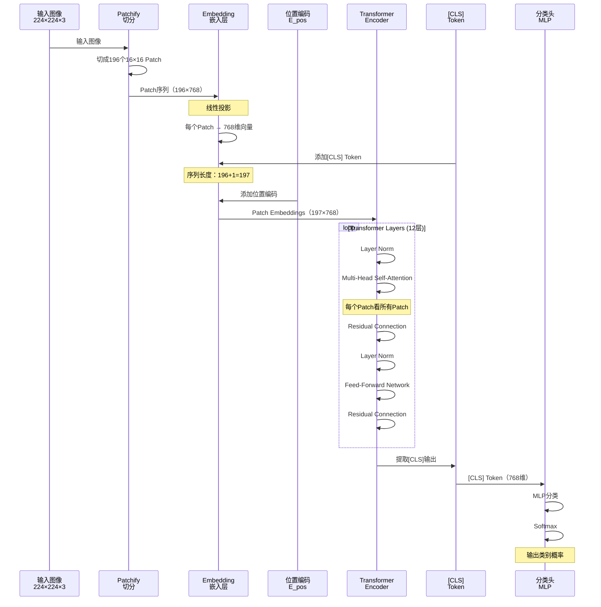

  **传统CNN（卷积神经网络）看图：**
  ```
  想象你用放大镜看画：
  1. 先看左上角3×3区域："这里有个边缘"
  2. 再看旁边3×3区域："这里也有边缘"
  3. 逐渐扩大视野，看更大区域
  4. 最后理解整幅画

  特点：局部 → 全局，逐步扩大视野
  ```

  **ViT看图：**
  ```
  想象你把画切成16×16的小方块：
  1. 第1块："蓝色，可能是天空"
  2. 第2块："绿色，可能是草地"
  3. 第3块："橘色+胡须，可能是猫的一部分"
  ...
  4. Transformer：看所有块的关系
     - "第3块的猫"和"第7块的爪子"有关系
     - "第1块的天空"在"第15块的草地"上方
  5. 理解整幅画：一只猫在草地上，蓝天背景

  特点：一开始就看全局关系
  ```

  ---

  **核心流程：**

  ```
  步骤1：Patch化（切成小块）

  原始图像：224×224×3（像素）
    ↓
  切成16×16的Patch：
    - Patch大小：16×16像素
    - Patch数量：(224/16) × (224/16) = 14×14 = 196个
    ↓
  每个Patch：16×16×3 = 768个值（展平成一维）

  ---

  步骤2：Patch Embedding（块嵌入）

  每个Patch：768维向量
    ↓
  线性投影：768维 → 768维嵌入
    ↓
  添加位置编码：
    "第1个Patch在左上角"
    "第196个Patch在右下角"
    ↓
Patch序列：[Patch1, Patch2, ..., Patch196]

  ---

  步骤3：添加[CLS] Token

  [CLS]是一个特殊的可学习向量
    ↓
序列变成：[[CLS], Patch1, Patch2, ..., Patch196]
  （197个Token）
    ↓
  [CLS]的作用：汇聚整张图的信息

  ---

  步骤4：Transformer Encoder

  for layer in 1 to 12:  # ViT-Base有12层
    Self-Attention：
      - 每个Patch看其他所有Patch
      - "猫的头部"Patch关注"猫的身体"Patch
      - "天空"Patch关注"地面"Patch
    ↓
    Feed-Forward Network：
      - 对每个Patch独立处理
    ↓

  ---

  步骤5：分类（或其他任务）

  提取[CLS] Token的输出
    ↓
  MLP分类器
    ↓
  输出：[猫=0.9, 狗=0.05, 鸟=0.03, ...]
  ```

  ---

  **为什么ViT有效？**

  **CNN的局限：**
  ```
  卷积核大小：3×3
  看一个像素只能看周围9个像素（局部）
  要看全局，需要堆叠很多层（VGG有19层）

  问题：
  - 感受野增长慢
  - 远距离关系难建模
  ```

  **ViT的优势：**
  ```
  Self-Attention：
  - 第1层就能看全局（所有Patch）
  - 直接建模远距离关系

  例如：
  - "左上角的猫脸"和"右下角的猫尾巴"
    → CNN需要10+层才能关联
    → ViT第1层就能关联
  ```

  ---

  **ViT vs CNN：**

  | 特性 | CNN | ViT |
  |------|-----|-----|
  | **归纳偏置** | 强（局部性、平移不变性） | 弱（从数据学习） |
  | **感受野** | 局部→全局（逐层扩大） | 全局（第1层） |
  | **数据需求** | 少（1M图像） | 多（100M+图像） |
  | **小数据表现** | 好 | 差 |
  | **大数据表现** | 好 | 更好 |
| **计算复杂度** | O(HWC) | O(((HW/P^2))^2) |
  | **可解释性** | 中（激活图） | 高（注意力图） |

  ---

  **ViT的三个关键设计：**

  **1. Patch Embedding（块嵌入）**
  ```
  为什么不直接用像素？
  - 224×224图像 = 50,176个像素
- Self-Attention复杂度：O(N^2) = 50,176^2 ≈ 2.5×10^9 次计算
  - 太慢了！

  用Patch：
  - 16×16 Patch → 196个Token
- Self-Attention复杂度：196^2 = 38,416次
  - 减少64,000倍！
  ```

  **2. 位置编码（Positional Encoding）**
  ```
  Transformer本身不知道顺序
  需要告诉模型"这是第几个Patch"

  两种方案：
  1. 可学习位置编码（ViT采用）
     pos_emb = nn.Parameter(torch.randn(1, 197, 768))

  2. 固定位置编码（Transformer原版）
     pos(i, 2j) = sin(i / 10000^(2j/d))
     pos(i, 2j+1) = cos(i / 10000^(2j/d))
  ```

  **3. [CLS] Token**
  ```
  来自BERT的设计

  为什么需要？
  - 每个Patch只代表局部
  - [CLS]汇聚所有Patch信息
  - 用于最终分类

  训练后[CLS]学到：
  - 整张图的全局表示
  - 类别判别信息
  ```

  ---

  **ViT的模型规模：**

  | 模型 | 层数 | 隐藏维度 | MLP维度 | 注意力头数 | 参数量 |
  |------|------|---------|---------|----------|--------|
  | ViT-Tiny | 12 | 192 | 768 | 3 | 5.5M |
  | ViT-Small | 12 | 384 | 1536 | 6 | 22M |
  | ViT-Base | 12 | 768 | 3072 | 12 | 86M |
  | ViT-Large | 24 | 1024 | 4096 | 16 | 307M |
  | ViT-Huge | 32 | 1280 | 5120 | 16 | 632M |

  ---

  **实际应用：**

  **1. 图像分类**
  ```
  ImageNet（100万图像）：
  - ViT-Huge：88.5%准确率
  - 超越所有CNN（EfficientNet：88.4%）
  ```

  **2. 目标检测**
  ```
  DETR（Detection Transformer）：
  - 用ViT作为骨干网络
  - 端到端目标检测
  ```

  **3. 图像分割**
  ```
  SegFormer：
  - ViT + 轻量级解码器
  - ADE20K数据集SOTA
  ```

  **4. 多模态（CLIP）**
  ```
  CLIP的图像编码器：
  - 就是ViT
  - 学习图文对齐
  ```

  ---

  **ViT的改进版本：**

  **1. DeiT（Data-efficient ViT）**
  ```
  问题：ViT需要大数据集
  解决：知识蒸馏
  - 用CNN教师模型指导ViT学生
  - ImageNet上训练，效果接近ViT-JFT
  ```

  **2. Swin Transformer**
  ```
问题：ViT复杂度O(N^2)，高分辨率慢
  解决：局部窗口Attention
  - 只在7×7窗口内做Attention
  - 层与层之间窗口移位（建模跨窗口关系）
  - 复杂度降到O(N)
  ```

  **3. BEiT（BERT pre-training of ViT）**
  ```
  问题：ViT需要标注数据
  解决：自监督预训练
  - 遮挡Patch，预测被遮挡内容
  - 类似BERT的Masked Language Model
  ```

  ---

  **常见误区：**

  **误区1："ViT比CNN好"**
  - 不一定！
    - 大数据：ViT更好
    - 小数据：CNN更好（归纳偏置有帮助）

  **误区2："ViT不需要卷积"**
  - 原版ViT确实不用卷积
  - 但很多改进版用卷积做Patch Embedding（效果更好）

  **误区3："ViT完全抛弃了归纳偏置"**
  - 不对！ViT还是有归纳偏置的：
    - Patch内的像素关系（通过Patch Embedding）
    - 2D位置关系（通过位置编码）

  说白了，ViT就是"用NLP的方法做CV"——把图像当文本，Patch当单词，Transformer当阅读理解。在大数据集上，ViT的全局理解能力超越CNN，成为视觉任务的新基准。
---


<!-- TODO: 添加ViT Patch化过程示意图，展示图像如何切分成Patch -->


ViT：把图片切成“词”，用读文章的方式看图，一上来就看全局。

## 为什么它重要（≤5min）
- 直接看全局：第1层就能建模远距离关系。
- 多任务可迁移：分类/检测/分割/多模态都可用。

## 怎么做（三步走）
- Patch Embedding：把图像切成16×16块，投影为向量。
- [CLS]汇总：给整图一个“总编辑”。
- Self-Attention：块块互看，关系自然浮现。


## 优缺点（一句到位）
- 优点：全局建模更强，规模越大越香。
- 缺点：小数据不友好、复杂度高。

## 易错点（别踩坑）
- 完全不要卷积？很多变体用小卷积做嵌入更稳。
- Patch越细越好？复杂度平方涨，需权衡。

## 适用场景（马上用得上）
- 图像编码（如CLIP）/分类/检测/分割

## 参考图源（供重绘或嵌入）
- ViT论文Patch示意（可重绘为统一风格SVG）

## 一页总结
- NLP思路在CV的成功嫁接；位置编码与Patch大小要选好。

## 核心概念

### ViT的设计思想

**问题：** 如何将Transformer应用于图像？

**挑战：**
```
文本：天然的序列（词 → 句子）
图像：2D矩阵（像素 → 图像）

问题：
- 像素太多（224×224 = 50,176个）
- Self-Attention复杂度O(N²)
- 计算量爆炸
```

**ViT的解决方案：**
```
不把每个像素当Token
而是把每个Patch（图像块）当Token

224×224图像
→ 切成16×16的Patch
→ 14×14 = 196个Patch
→ 196个Token（可接受的序列长度）
```

### 核心组件

**Patch Embedding：**
- 功能：将2D图像Patch转为1D嵌入向量
- 方法：线性投影（或小卷积）
- 输出：Token序列

**Positional Encoding：**
- 功能：编码Patch的2D位置信息
- 方法：可学习的位置嵌入
- 作用：让模型知道Patch的空间位置

**Transformer Encoder：**
- 功能：建模Patch间的关系
- 组件：Multi-Head Self-Attention + FFN
- 特点：与NLP的Transformer完全相同

**Classification Head：**
- 功能：输出分类结果
- 输入：[CLS] Token的输出
- 结构：MLP

## 工作流程

### 完整流程示意

步骤1：Patch化
- 输入图像：
```math
x \in \mathbb{R}^{H \times W \times C}
```
- 例如：224×224×3（ImageNet标准）
- 切分成Patch：Patch大小 P×P（通常 P=16）
```math
N = (H/P) \times (W/P) = (224/16)^2 = 196
```
- 展平每个Patch：每个Patch维度 `P\times P\times C = 16\times16\times3 = 768`
- Patch序列：
```math
x_p \in \mathbb{R}^{N \times (P^2 C)}
```

步骤2：Patch Embedding
- 线性投影层：
```math
E \in \mathbb{R}^{(P^2 C) \times D}
```
- 嵌入：
```math
z_0 = [x_p^1 E;\; x_p^2 E;\; ...;\; x_p^N E]
```
- 添加 [CLS] Token：
```math
z_0 = [x_{class};\; x_p^1 E;\; x_p^2 E;\; ...;\; x_p^N E]
```
- 添加位置编码：
```math
z_0 = z_0 + E_{pos},\quad E_{pos} \in \mathbb{R}^{(N+1) \times D}
```

步骤3：Transformer Encoder（L 层）
```math
z'_l = MSA\big(LN(z_{l-1})\big) + z_{l-1}
```
```math
z_l = MLP\big(LN(z'_l)\big) + z'_l
```
- 其中：LN（LayerNorm）、MSA（多头自注意力）、MLP（[D, 4D, D]）

步骤4：分类
```math
y = LN\big(z_L^{0}\big)
```
```math
\text{logits} = MLP(y),\quad \text{probs} = \text{softmax}(\text{logits})
```
输出：类别概率分布

### ViT时序图



### Self-Attention的作用

**传统CNN：**
```
层1：看3×3局部区域
层2：看7×7区域（堆叠后）
层3：看15×15区域
...
层10：看大部分图像

感受野逐层增长
```

**ViT：**
```
层1：每个Patch看所有Patch（全局）
层2：每个Patch看所有Patch（全局）
...

第1层就是全局感受野
```

**注意力可视化：**
```
查询：左上角的猫头Patch
注意力分数：
  - 猫头Patch自己：0.3
  - 猫身体Patch：0.4（高关注）
  - 猫尾巴Patch：0.2
  - 背景Patch：0.1（低关注）

→ 模型学到了"猫头"和"猫身体"的关联
```

## 数学原理

### Patch Embedding

**输入：**
```math
x \in \mathbb{R}^{H \times W \times C}
```

**切分：**
```math
x_p \in \mathbb{R}^{N \times (P^2 C)}
```

其中：
- N = HW/P^2：Patch数量
- P：Patch大小

**线性投影：**
```math
z_0 = [x_{class};\; x_p\, E] + E_{pos}
```

其中：
```math
E \in \mathbb{R}^{(P^2 C) \times D}
```
```math
E_{pos} \in \mathbb{R}^{(N+1) \times D}
```
```math
x_{class} \in \mathbb{R}^{1 \times D}
```

### Multi-Head Self-Attention

**单头Attention：**

```math
\text{Attention}(Q, K, V) = \text{softmax}\left(\frac{QK^T}{\sqrt{d_k}}\right) V
```

其中：
- $Q = z W_Q$：查询
- $K = z W_K$：键
- $V = z W_V$：值
- $d_k$：键的维度

**多头Attention：**

```math
\text{MSA}(z) = [\text{head}_1; \text{head}_2; \ldots; \text{head}_h] W_O
```

```math
\text{head}_i = \text{Attention}(z W_Q^i, z W_K^i, z W_V^i)
```

其中：
- $h$：注意力头数（ViT-Base：$h=12$）
- $W_Q, W_K, W_V$：每个头的投影矩阵
- $W_O$：输出投影矩阵

### Feed-Forward Network

```math
MLP(x) = GELU(xW_1 + b_1)\,W_2 + b_2
```

其中：
```math
W_1 \in \mathbb{R}^{D \times 4D}
```
```math
W_2 \in \mathbb{R}^{4D \times D}
```
- GELU：激活函数

## ViT变体与改进

### DeiT（Data-efficient ViT）

**问题：** ViT需要大数据集（JFT-300M：3亿图像）

**解决方案：**

1. **知识蒸馏（Distillation）：**
```
教师模型：预训练的CNN（如RegNet）
学生模型：ViT

损失函数：
L = L_CE(y, y_true) + λ L_KD(y, y_teacher)

其中：
- L_CE：交叉熵损失
- L_KD：蒸馏损失
- λ：蒸馏权重
```

2. **Distillation Token：**
```
添加额外的可学习Token：[DIST]

序列：[[CLS], [DIST], Patch1, ..., Patch_N]

[CLS]：学习真实标签
[DIST]：学习教师输出

最终预测：([CLS] + [DIST]) / 2
```

**结果：**
- 只用ImageNet（100万图像）
- 达到ViT-JFT的84%性能

### Swin Transformer

**问题：** ViT的Self-Attention复杂度O(N^2)，高分辨率时太慢

**解决方案：** 局部窗口Attention + 层级结构

```
层1：
  - 将图像切成4×4的窗口
  - 每个窗口内做Self-Attention（局部）

层2：
  - 窗口移位（Shifted Window）
  - 建模跨窗口关系

层3-4：
  - 下采样，窗口变大
  - 类似CNN的层级结构
```

**优势：**
- 复杂度：O(N^2) → O(N)
- 适合高分辨率（1024×1024）
- 适合密集预测（检测、分割）

### BEiT

**问题：** 有监督预训练需要大量标注数据

**解决方案：** 自监督预训练（类似BERT）

```
预训练任务：Masked Image Modeling

步骤：
1. 随机遮挡40%的Patch
2. 预测被遮挡Patch的内容
3. 目标：离散化的视觉Token（通过DALL-E的Tokenizer）

微调：
  - 加分类头
  - ImageNet微调
```

**结果：**
- ImageNet-1K：88.6%（超越DeiT）

## 实际应用

### 1. CLIP（OpenAI）

**图像编码器：** ViT-L/14

```
架构：
- ViT-Large（307M参数）
- Patch大小：14×14
- 输入：224×224图像

训练：
- 4亿图文对
- 对比学习（图像-文本对齐）
```

### 2. DALL-E 2

**图像理解：** CLIP ViT

```
CLIP ViT：
  图像 → 图像嵌入（768维）

Prior网络：
  文本嵌入 → 图像嵌入

Decoder：
  图像嵌入 → 图像
```

### 3. Segment Anything Model (SAM)

**图像编码器：** ViT-H

```
架构：
- ViT-Huge（632M参数）
- MAE预训练
- SA-1B数据集（10亿遮罩）
```

## 性能对比

### ImageNet-1K分类

| 模型 | 参数量 | Top-1准确率 | 数据集 |
|------|--------|------------|--------|
| **CNN** |
| ResNet-50 | 25M | 76.2% | ImageNet-1K |
| EfficientNet-B7 | 66M | 84.4% | ImageNet-1K |
| **ViT** |
| ViT-B/16 | 86M | 77.9% | ImageNet-1K |
| ViT-B/16 | 86M | 84.0% | ImageNet-21K |
| ViT-L/16 | 307M | 87.8% | JFT-300M |
| **改进版** |
| DeiT-B | 86M | 83.1% | ImageNet-1K（+蒸馏） |
| Swin-L | 197M | 87.3% | ImageNet-22K |
| BEiT-L | 307M | 88.6% | ImageNet-1K（自监督） |

### 计算复杂度

| 模型 | FLOPs | 吞吐量（图像/秒） |
|------|-------|------------------|
| ResNet-50 | 4.1G | 870 |
| ViT-B/16 | 17.6G | 320 |
| ViT-L/16 | 61.6G | 95 |
| Swin-B | 15.4G | 420 |

## 常见问题

**Q: 为什么ViT需要大数据集？**

A:
- **CNN的归纳偏置**：
  - 局部性（卷积核看局部）
  - 平移不变性（权重共享）
  - 小数据时很有帮助

- **ViT的弱归纳偏置**：
  - 需要从数据学习局部性
  - 数据少时学不到，过拟合

**Q: ViT的[CLS] Token从哪来？**

A:
- 来自BERT的设计
- 随机初始化，训练时学习
- 训练后自动汇聚全局信息

**Q: 为什么用可学习位置编码而不是固定的？**

A:
- 实验发现效果差不多
- 可学习更灵活（如支持可变分辨率）
- 计算简单（直接相加）

**Q: Patch大小如何选择？**

A:
| Patch大小 | Patch数量 | 计算量 | 细节 | 适用场景 |
|----------|----------|--------|------|---------|
| 32×32 | 49 | 低 | 低 | 快速原型 |
| 16×16 | 196 | 中 | 中 | 标准（ImageNet） |
| 14×14 | 256 | 中 | 中 | CLIP |
| 8×8 | 784 | 高 | 高 | 高分辨率 |

## 参考资料

- [An Image is Worth 16x16 Words](https://arxiv.org/abs/2010.11929) - ViT原论文
- [Training data-efficient image transformers](https://arxiv.org/abs/2012.12877) - DeiT论文
- [Swin Transformer: Hierarchical Vision Transformer using Shifted Windows](https://arxiv.org/abs/2103.14030)
- [BEiT: BERT Pre-Training of Image Transformers](https://arxiv.org/abs/2106.08254)
- [什么是Transformer](/guide/ai/what-is-transformer) - 本站相关文章
- [什么是Multi-Head Attention](/guide/ai/what-is-multi-head-attention) - 本站相关文章
